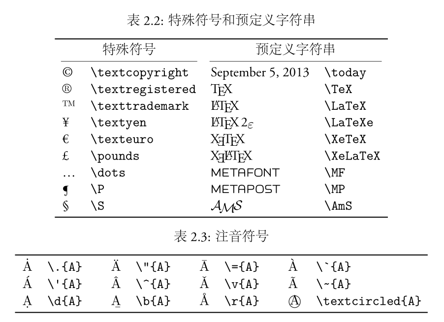

# LaTex学习


# 一. 入门

[TOC]


## 语法和结构

### 1. 语法

语句可分为三种：

1. 命令（command）
2. 数据
3. 注释（comment）

> 普通命令以 \ 起始，大多只有一行；而环境包含一对起始声明和结尾声明，用于多行内容的场合。命令和环境可以互相嵌套。数据就是普通内容。注释语句以 % 起始，它在编译过程中被忽略。

### 2. 物理结构

主要包括序言(preamble)和正文两部分

序言用来完成一些设置，比如指定文档类型，引入宏包，定义命令、环
境等；文档的实际内容则放在正文部分。它们的基本用法如下：
```latex
\documentclass[options]{class}  % 文 档 类 声 明
\usepackage[options]{package}  % 引 入 宏 包
...
\begin{document}  % 正文
...
\end{document}
```

> 常用的文档类（documentclass）有article, report, book等

### 3. 逻辑结构

一份文档的开头通常有标题、作者、摘要等信息，之后是章节等层次结
构，内容则散布于层次结构之间。文档比较长时我们还可以使用目录。
标题、作者、日期等命令用法如下，注意 \maketitle 命令要放在最后。
```latex
\title{LaTeX Notes}
\author{Alpha Huang}
\date{\today}
\maketitle
```
article 和 report 可以有摘要，book 里没有。摘要环境用法如下：
```
\begin{abstract}
...
\end{abstract}
```
LATEX 提供了七种层次结构命令，每个高级层次可以包含若干低级层次。
article 中没有 chapter，而 report 和 book 则支持所有层次。

```latex
\part{...}  %Level -1
\chapter{...}  %Level 0
\section{...}  %Level 1
\subsection{...}  %Level 2
\subsubsection{...} %Level 3
\paragraph{...}  %Level 4
\subparagraph{...}  %Level 5
```

我们可以用 \tableofcontents 命令来生成目录。系统会自动设定目录
包含的章节层次，用户也可以显式指定目录层次深度。比如下面的命令指定
目录深度为 2，也就是只显示 subsection 及以上层次的目录。注意设定目录
深度命令要放在列目录命令的前面。
```latex
\setcounter{tocdepth}{2} % 设 定 目 录 深 度
\tableofcontents  % 列 出 目 录
```

初次使用目录，或章节图表等层次结构发生变化时，都需要执行两遍编
译命令才能获得正确结果。LATEX 之所以设计成这样是因为当时的电脑内存
容量有限。

如果我们不想让某些层次的标题出现在目录里，则可以给 例 2.2 中的命
令加上星号。
```latex
\chapter*{...}
\section*{...}
\subsection*{...}
\subsubsection*{...}
```

类似地，我们也可以用下面的命令生成插图和表格目录，插图和表格功
能将在后面相关章节中介绍。这两种目录也都需要编译两遍。

```latex
\listoffigures
\listoftables
```

## 文字

文档的内容可以分为文本模式和数学模式。前者是缺省工作方式；要输入数学内容则需要特殊命令或环境。

### 1. 字符输入

文档中可以输入的文字符号大致可以分为：普通字符、控制符、特殊符
号、预定义字符串、注音符号等。

普通字符可以直接输入，而有些字符 (例如 # $ % ˆ & _ { } ˜ 等) 被用作特殊
的控制符，输入时多数需要在前面加个 \。而 \ 本身则要用 \textbackslash
命令来输入，因为 \\ 被用作换行指令2。

```latex
\# \$ \^ \& \_ \{ \} \~ \textbackslash \%
```

LATEX 中有短划线 (hypen) 、中划线 (en-dash) 和长划线 (em-dash) 。短划线又称连字符，用来连接单词；中划线用来连接数字，可以通过重复两次短划线得到；长划线类似于中文的破折号，重复三次短划线。



### 2. 字体样式和大小

