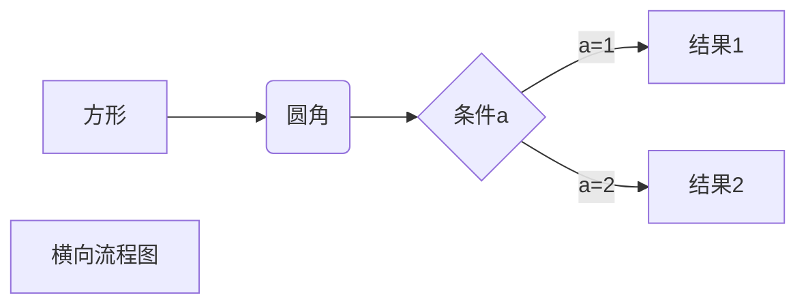
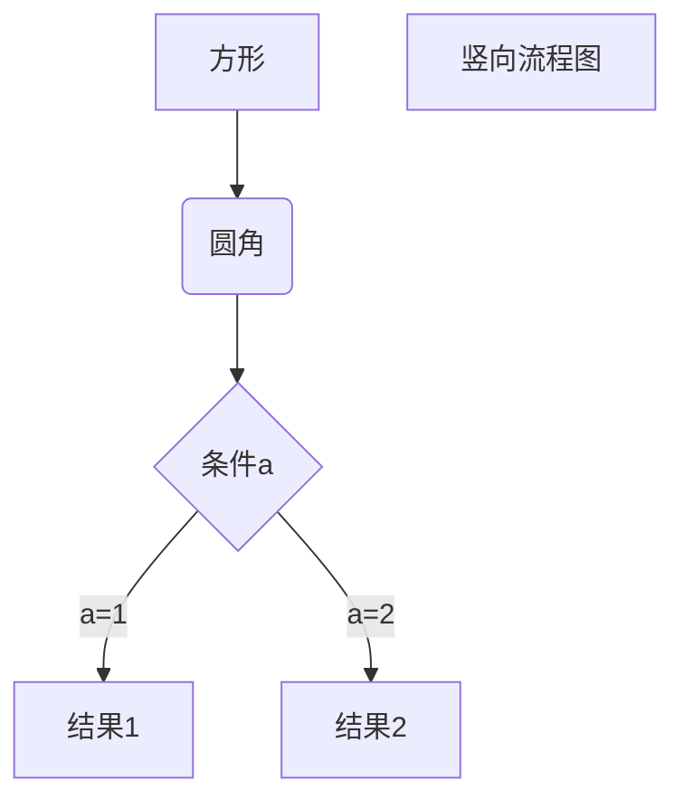

<u><font size=6 >说在前面的话:</font></u>

**<kbd>made by 龙龙龙</kbd>**

<kbd>**将代码块内的代码复制，然后粘贴在Typora内，即可看到样式了**</kbd>

基于Typora的markdown使用方法，Typora最新版1.3可以使用

想下载最新版本的Typora，我只能指路在这个文章里面有

[Typora功能汇总（2022.7.23日更新） - 知乎](https://zhuanlan.zhihu.com/p/483671352)

gitee更新地址：https://gitee.com/dragon-dragon-ago/Typora-markdown

[toc]

# 0. 什么是Typora

<font color='red'>Typora</font> 是一款**支持实时预览的 <kbd>Markdown</kbd> 文本编辑器**。【**功能之强大、设计之冷静、体验之美妙、理念之先进**】

一个文本编辑器，**写得舒服**是关键。「更有趣的是，一个笔记应用不会因为它支持 Markdown 语法而高级或易用很多。」，细枝末节处的人性化考虑才是最重要的。而 Typora 的编辑体验显然是经过深思熟虑设计的产物。

# 1. 基础操作

## 1.1标题

```markdown
# 		一级标题

## 		二级标题

### 	三级标题

#### 	四级标题

##### 	五级标题

###### 	六级标题
```


## 1.2 引用

```markdown
>  引用内容1
>  引用内容2
>> 引用内容3
```

> > 引用内容3

## 1.3 斜体

```markdown
*斜体*
_斜体_
```


## 1.4 加粗

```markdown
**加粗**
__加粗__
***加粗斜体***
```


## 1.5 下划线

```markdown
<u>下划线</u>
```


## 1.6 删除线 

```markdown
~~删除线~~
```


## 1.7 分割线

```markdown
***
---
___
```


## 1.8 注脚

```markdown
Typora[^1]
[^1]:A markdown editor
```

Typora[^1]
[^1]:A markdown editor

## 1.9 上下标,高亮

```markdown
5<sup>2</sup>=25
H<sub>2</sub>OCO<sub>2</sub>

#以下需要在文件->偏好设置->markdown->markdown拓展语法勾选
6^2^=36
H~2~O
==高亮==
```


## 1.10 目录

```markdown
[soc] 自动生成目录
```


## 1.11 换行

```markdown
</br>
在需要换行的地方插入</br>
```

### 1.11.1 软换行


# 2. 代码

## 2.1 单行代码

```markdown
==String str1 = "hello==
```

==String str1 = "hello==

## 2.2 多行代码

```html
======
~~~
~~~python
​======c
```


## 2.3 注释

```html
#html注释
<!-- 注释 -->
#hack方法
[^_^]: # (我是注释，超级萌。)
*[·-·]:注释内容
*[^_^]:注释内容
*[@_@]:注释内容
```

# 3. 列表

## 3.1 无序列表

```markdown
* 无序列表1
+ 无序列表2
- 无序列表3
```


## 3.2 多行无序列表

```markdown
*         无序列表1
TAB *     无序列表2
TAB TAB * 无序列表3
```


## 3.3 有序列表

```markdown
1. 有序列表1
2. 有序列表2
3. 有序列表3
```


## 3.4 多行有序列表

```markdown
1. 多行有序列表1
2. 多行有序列表2
    1. 多行有序列表2-1
    2. 多行有序列表2-2
3. 多行有序列表3
    1. 多行有序列表3-1
    2. 多行有序列表3-2
```


## 3.5 任务列表

```markdown
- [ ] 任务1
- [x] 任务2(打勾的选项)
```


## 3.6 表格

```markdown
Ctrl + t
|姓名|性别|年龄|手机号|
|：---|：--：|：--：|---：|
|张三|男|21|18975346876|
|李四|女|23|17789548964|
|王五|男|25|15876513546|
```


# 4. 链接

## 4.1 图片

```markdown
	#本地图片
	#网络图片
```


## 4.2 超链接

```markdown
样式1.
	[百度](https://www.baidu.com/)
样式2.
	[CSDN][CSDN网址]
	[CSDN网址]:https://www.csdn.net/
样式3.
	<https://www.csdn.net/>
```


## 4.3 框架

```markdown
<iframe src="链接"...参数...></iframe>
```


# 5. 符号的输入

## 5.1 普通符号

```markdown
\\
\==
\*
\_
\{\}
\[\]
\(\)
\#
\+
\-
\.
\!
```


## 5.2 特殊符号

```markdown
&copy;   版权
&reg;    注册商标
&trade;  商标
&nbsp;   空格
&amp;    和号
&quot;   引号
&apos;   撇号
&lt;     小于号
&gt;     大于号
&ne;     不等号
&le;     小于等于
&ge;     大于等于
&cent;   分
&pound;  磅
&euro;   欧元
&yen;    元
&sect;   节
&times;  乘号
&divide; 除号
&plusmn; 正负号
```

&yen;

## 5.3 更多符号

[HTML特殊字符编码对照表](https://www.jb51.net/onlineread/htmlchar.htm)


## 5.4 表情符号

```markdown
#支持添加emoji表情，输入不同的符号码（两个冒号包围的字符）可以显示出不同的表情。
#最新版本的Typora支持彩色表情了
:smile:
```

**更多表情:[emoji](https://github.com/guodongxiaren/README/blob/master/emoji.md)**

# 6. 快捷键

```markdown
F8    		专注模式
F9    		打字机模式
Ctrl+1  	一阶标题    
Ctrl+2  	二阶标题    
Ctrl+3  	三阶标题    
Ctrl+4  	四阶标题    
Ctrl+5  	五阶标题    
Ctrl+6  	六阶标题    
Ctrl+B  	字体加粗(Blod)
Ctrl+I  	字体倾斜(Italic)
Ctrl+U  	下划线(Underline)
Ctrl+Z		撤销
Ctrl+T		创建表格(Table)				    
Ctrl+L  	选中某句话   
Ctrl+K  	创建超链接
Ctrl+D  	选中某个单词  
Ctrl+F  	搜索(Find)
Ctrl+H		搜索并替换
Ctrl+\		清楚样式
Ctrl+E  	选中相同格式的文字  
Ctrl+Home	 	返回Typora顶部	
Ctrl+End     	返回Typora底部
Alt+Shift+5 	删除线 
Ctrl+Shift+I    插入图片(Image)
Ctrl+Shift+M    公式块 
Ctrl+Shift+K	代码块
Ctrl+Shift+Q    引用(Quote)
```


# 7. 公式

## 7.1 Latex公式

略，这部分请自行查看相关文件

同时推荐一个可视化的[LaTeX公式编辑器](https://www.latexlive.com/home)

https://www.latexlive.com/

**公式大全（常用版）：**[https://www.xmind.cn/faq/question/equation/](https://link.zhihu.com/?target=https%3A//www.xmind.cn/faq/question/equation/)

**公式大全（完整版）：**[https://zhuanlan.zhihu.com/p/67](https://zhuanlan.zhihu.com/p/67251812)

转自知乎

# 8.Typora表情

:warning:Typora现在已经支持彩色表情！！！

我觉得这是我最目前最喜欢的一个改善

可以在正文在标题中插入表情，让你的md文件变得更加丰富多彩！！！

[表情网址大全](https://www.webfx.com/tools/emoji-cheat-sheet/) : https://www.webfx.com/tools/emoji-cheat-sheet/

快速输入方法，输入`:`后依次输入单词的首字母，会联想输入

# 9. Typora设置

## 9.1 偏好设置

​		菜单栏-文件=>偏好设置
## 9.2 模式

​		菜单栏__视图=>...

​		**「专注模式」**使你正在编辑的那一行保留颜色，而其他行的字体呈灰色。

​		**「打字机模式」**使得你所编辑的那一行永远处于屏幕正中。

​		**「源代码模式」**以源代码显示

## 9.3 主题设置

​		菜单栏==>主题

​		选择一个喜欢的主题来使用吧！

## 9.4 图片插入

- 直接使用 ==右键 - 复制 Ctrl + V== 将网络图片、剪贴板图片复制到文档中
- 拖动本地图片到文档中

Typora 会自动帮你插入符合 Markdown 语法的图片语句，并给它加上标题。


你也完全可以使用图床来保证文档在分享后图片仍能正常显示。

更强大的是，Typora 支持在拖动或 ==Ctrl + V== 网络图片后自动将其保存到本地。你可以在 ==文件 - 偏好设置 - 编辑器 - 图片插入== 中选择复制到哪个路径，什么情况下需要复制。

图片插入

这一功能保证了即使网络图片源失效了，你还有本地的备份可用。同时也能使你的文档文件夹更合理、完整。

## 9.5 空格与换行

Typora 在空格与换行部分主要是使用 [CommonMark](http://www.commonmark.cn/w/) 作为标注规范。与前文提到的 GFM 一样，CommonMark 也是比较流行的 Markdown 语言规范（解析器）之一。

- **空格：**在输入连续的空格后，Typora 会在编辑器视图里为你保留这些空格，但当你打印或导出时，这些空格会被省略成一个。 
	你可以在源代码模式下，为每个空格前加一个==转义符==，或者直接使用 HTML 风格的 ==&nbps;== 来保持连续的空格。
- **软换行：**需要说明的是，在 Markdown 语法中，换行（line break）与换段是不同的。且换行分为软换行和硬换行。在 Typora 中，你可以通过 ==Shift + Enter== 完成一次软换行。软换行只在编辑界面可见，当文档被导出时换行会被省略。
- **硬换行：**你可以通过 ==空格 + 空格 + Shift + Enter== 完成一次硬换行，而这也是许多 Markdown 编辑器所原生支持的。硬换行在文档被导出时将被保留，且没有换段的段后距。
- **换段：**你可以通过 ==Enter== 完成一次换段。Typora 会自动帮你完成两次 ==Shift + Enter== 的软换行，从而完成一次换段。这也意味着在 Markdown 语法下，换段是通过在段与段之间加入空行来实现的。
- **Windows 风格（CR+LF）与 Unix 风格（CR）的换行符：**CR 表示回车 ==\r== ，即回到一行的开头，而 LF 表示换行 ==\n== ，即另起一行。 
	所以 Windows 风格的换行符本质是「回车 + 换行」，而 Unix 风格的换行符是「换行」。这也是为什么 Unix / Mac 系统下的文件，如果在 Windows 系统直接打开会全部在同一行内。 你可以在 ==文件 - 偏好设置 - 编辑器 - 默认换行符== 中对此进行切换。

下附以上各空格、换行、换段的测试结果图。具体内容你可以在官网的 [这篇文档](http://support.typora.io/Line-Break/) 中查阅。


# 10. 进阶知识

## 10.1 HTML

Markdown支持HTML的标签

颜色代码查询:**[RGB颜色查询表](https://blog.csdn.net/heimu24/article/details/81192697)**


## 10.2 字体、字号、颜色设置

```html
<font face="微软雅黑" >微软雅黑字体</font>
<font face="黑体" >黑体</font>
<font size=3 >3号字</font>
<font size=4 >4号字</font>
<font color=#FF0000 >红色</font>
<font color=#008000 >绿色</font>
<font color=#0000FF >蓝色</font>
<font color=#0099ff size=7 face="黑体">集中在一个标签中</font>
```


## 10.3 文字添加背景色

```html
<table>
    <tr align=center>
        <td bgcolor=yellow>背景色yellow</td>
    </tr>
</table>
```

<table>
    <tr align=center>
        <td bgcolor=yellow>背景色yellow</td>
    </tr>
</table>

| 属性    | 描述                       | 参数                                                        |
| ------- | -------------------------- | ----------------------------------------------------------- |
| align   | 定义表格行的内容对齐方式。 | right     右对齐<br/>left       左对齐<br/>center  居中对齐 |
| bgcolor | 规定表格行的背景颜色。     | rgb(x,x,x)<br/>#xxxxxx<br/>颜色名字                         |


## 10.4 按键效果

```html
html的行内元素<kbd></kbd>，可以达到表示按键的效果
<kbd>ctrl</kbd> + <kbd>R</kbd>
```

<kbd>ctrl</kbd> + <kbd>R</kbd>


## 10.5 设置图片大小

### 10.5.1 设置图片百分比

```markdown

```

### 10.5.2 设置图片大小

```markdown

```

### 10.5.3 设置图片居中

```markdown
<div align=right></div>
```


## 10.6 流程图

###  10.6.1 横向流程图源码格式

```markdown
graph LR
A[方形] --> B(圆角)
    B --> C{条件a}
    C --> |a=1| D[结果1]
    C --> |a=2| E[结果2]
    F[横向流程图]
```




### 10.6.2 竖向流程图源码格式

```markdown
graph TD
A[方形] --> B(圆角)
    B --> C{条件a}
    C --> |a=1| D[结果1]
    C --> |a=2| E[结果2]
    F[竖向流程图]
```



### 10.6.4 标准流程图源码格式

```markdown
st=>start: 开始框
op=>operation: 处理框
cond=>condition: 判断框
sub1=>subroutine: 子流程
io=>inputoutput: 输入输出框
e=>end: 结束框
st->op->cond
cond(yes)->io->e
cond(no)->sub1(right)->op
```

```flow
st=>start: 开始框
op=>operation: 处理框
cond=>condition: 判断框
sub1=>subroutine: 子流程
io=>inputoutput: 输入输出框
e=>end: 结束框
st->op->cond
cond(yes)->io->e
cond(no)->sub1(right)->op
```

### 10.6.5   标准流程图源码格式(横向)

```markdown
st=>start: 开始框
op=>operation: 处理框
cond=>condition: 判断框(是或否?)
sub1=>subroutine: 子流程
io=>inputoutput: 输入输出框
e=>end: 结束框
st(right)->op(right)->cond
cond(yes)->io(bottom)->e
cond(no)->sub1(right)->op
```


```flow
st=>start: 开始框
op=>operation: 处理框
cond=>condition: 判断框(是或否?)
sub1=>subroutine: 子流程
io=>inputoutput: 输入输出框
e=>end: 结束框
st(right)->op(right)->cond
cond(yes)->io(bottom)->e
cond(no)->sub1(right)->op
```

# 11. 拓展

## 11.1 AutoHotKey

### 11.1.1 初始代码

由于Typora无法自行调节字体颜色，需要用HTML标签来设置，而手动输入标签设置太过繁琐，经过在网上查阅相关知识，最终选择使用AutoHotKey（以下简称AHK）来进行快捷设置

1. 下载AHK，点击链接下载 [AHK下载](https://autohotkey.com/download/ahk-install.exe)

2. 点击安装，右键新建一个AHK文件

3. 输入以下代码,并保存

	```AHK
	; Typora
	; 快捷增加字体颜色
	; SendInput {Text} 解决中文输入法问题
	
	#IfWinActive ahk_exe Typora.exe
	{
	    ; alt+0 kbd
	    !0::addKbd()
	  
	    ; alt+1 红色
	    !1::addFontColor("red")
	
	    ; alt+1 橙色
	    !2::addFontColor("orange") 
	
	     ; alt+3 黄色
	    !3::addFontColor("yellow")
	
	     ; alt+4 绿色
	    !4::addFontColor("green")
	
	    ; alt+5 浅蓝色
	    !5::addFontColor("cornflowerblue")
	
	     ; alt+6 青色
	    !6::addFontColor("cyan") 
	
	   ; alt+7 紫色
	    !7::addFontColor("purple")
	
	}
	
	; 快捷增加字体颜色
	addFontColor(color){
	    clipboard := "" ; 清空剪切板
	    Send {ctrl down}c{ctrl up} ; 复制
	    SendInput {TEXT}<font color='%color%'>
	    SendInput {ctrl down}v{ctrl up} ; 粘贴
	    If(clipboard = ""){
	        SendInput {TEXT}</font> ; Typora 在这不会自动补充
	    }else{
	        SendInput {TEXT}</ ; Typora中自动补全标签
	    }
	}
	addKbd(){
	    clipboard := "" ; 清空剪切板
	    Send {ctrl down}c{ctrl up} ; 复制
	    SendInput {TEXT}<kbd>
	    SendInput {ctrl down}v{ctrl up} ; 粘贴
	    If(clipboard = ""){
	        SendInput {TEXT}</kbd> ; Typora 在这不会自动补充
	    }else{
	        SendInput {TEXT}</ ; Typora中自动补全标签
	    }
	}
	```
	

### 11.1.2 VHK美化

**需要一定的windows操作基础**

1.对代码进行修改,确保启动VHK的同时还能启动Typora

```
; Typora
; 快捷增加字体颜色，同时打开同时关闭
; SendInput {Text} 解决中文输入法问题

;Typora的运行路径
Run,D:\我的程序\typora\Typora\Typora.exe

;设置延迟1秒，避免程序还未加载，就退出脚本
sleep 1000

;每隔一秒判断一次窗口是否还在，不在则退出窗口
while WinExist("ahk_exe Typora.exe"){
sleep 1000
}
ExitApp

;修改字体颜色，快捷键只在Typora内可以用
#IfWinActive ahk_exe Typora.exe
{
    ; alt+0 kbd
    !0::addKbd()
  
    ; alt+1 红色
    !1::addFontColor("red")

    ; alt+1 橙色
    !2::addFontColor("orange") 

     ; alt+3 黄色
    !3::addFontColor("yellow")

     ; alt+4 绿色
    !4::addFontColor("green")

    ; alt+5 浅蓝色
    !5::addFontColor("cornflowerblue")

     ; alt+6 青色
    !6::addFontColor("cyan") 

   ; alt+7 紫色
    !7::addFontColor("purple")

}

; 快捷增加字体颜色
addFontColor(color){
    clipboard := "" ; 清空剪切板
    Send {ctrl down}c{ctrl up} ; 复制
    SendInput {TEXT}<font color='%color%'>
    SendInput {ctrl down}v{ctrl up} ; 粘贴
    If(clipboard = ""){
        SendInput {TEXT}</font> ; Typora 在这不会自动补充
    }else{
        SendInput {TEXT}</ ; Typora中自动补全标签
    }
}
addKbd(){
    clipboard := "" ; 清空剪切板
    Send {ctrl down}c{ctrl up} ; 复制
    SendInput {TEXT}<kbd>
    SendInput {ctrl down}v{ctrl up} ; 粘贴
    If(clipboard = ""){
        SendInput {TEXT}</kbd> ; Typora 在这不会自动补充
    }else{
        SendInput {TEXT}</ ; Typora中自动补全标签
    }
}
```

2.对Typora启动快捷方式所指向路径修改


3.这里会发现启动方式的图标变了,变成一个VHK的图标,这里点击上图的更改图标,选择Typora.exe,发现有图标提供选择,选择原始那个就好

4.修改完毕，<font color='orange'>尽情使用吧！</font>

## 	11.2 VLOOK^TM^

### 11.2.1 什么是 VLOOK^TM^

[VLOOK™](https://github.com/MadMaxChow/VLOOK) 是针对由 [Typora](https://www.typora.io/)（目前最好的跨平台 Markdown 编辑器，没有之一）导出的 HTML 文件进行增强的插件。

VLOOK™ 也许是目前最好的 Markdown 增强插件之一，也是==**开源中国（[OSChina.net](https://www.oschina.net/p/vlook)）推荐的国产开源产品**。==

[VLOOK™说明文档及演示](https://madmaxchow.github.io/VLOOK/theme-fancy.html) 


## 11.3 Typora主题推荐

**Typora** 官网主题 : https://theme.typora.io/

为 Typora 编写自定义主题: **https://theme.typora.io/doc/Write-Custom-Theme/** （可以自己编写）

官网主题推荐 **Drake**

- 白天主题 Drake Google
- 晚上主题 Drake Vue3


### 下载主题方法

打开主题的网址

选中喜欢的主题

点击下载

:warning:有部分下载的压缩包，请解压，然后把解压出来的所有文件都按照下方的方法移入文件夹

### 安装主题方法

- 首先确定已安装[Typora](https://typora.io/)
- 通过`文件 -> 偏好设置 -> 打开主题文件夹`打开theme目录
- 复制你想要的对应主题名称`*.css`后缀文件 到`theme`目录下然后重启, 选择菜单 -> 主题
- 重启


# 12.其他软件

在2022年，Typora再也不是非你不可，Typora还是没有更新仓库文件夹。

并且现在的笔记软件已经进入到了一条新的赛道上，那就是==第二大脑==的工作流

相关链接如下

建立第二个大脑：概述 - 知乎
https://zhuanlan.zhihu.com/p/434544404

推荐黑曜石，也就是 obsidian 软件

