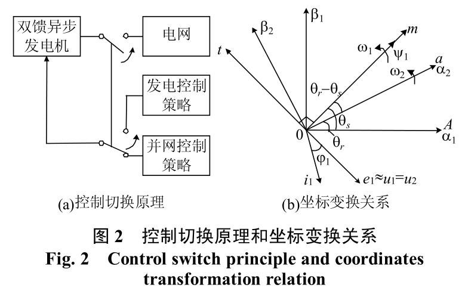

# 交流励磁变速恒频风力发电机的运行控制及建模仿真

[TOC]

 [交流励磁变速恒频风力发电机的运行控制及建模仿真.pdf](..\..\..\Desktop\交流励磁变速恒频风力发电机的运行控制及建模仿真.pdf) 

## 摘要（absstract)

1. 交流励磁

2. 变速恒频

3. 定子磁链定向
4. 矢量控制
5. 建模仿真

## 1. 引言

> 交流励磁变速恒频（AC-Exited Variable-SpeedConstant-Frequency，AEVSCF）发电技术是一种全新、高效的发电方式，具有显著的优越性[1-6]：不但可以大大提高能量转换效率，降低原动机承受的机械应力，而且还能实现有功﹑无功功率的解耦控制，提高电力系统的调节能力及稳定性[4]。AEVSCF发电技术适用于风力﹑水力等绿色能源开发领域，尤其在风力发电方面得到了广泛的应用[2,7]
>

> 双馈异步发电机定子并网发电，转子接电力变换器

> 交流励磁是指通过变换器可改变转子励磁电流的频
> 率、幅值和相位。

> 发电机的运行可分为并网前和并网后

## 2.双馈异步发电机的运行控制

### 2.1 总述

AEVSCDF风力发电机并网前实施并网控制，并网后实施最大风能追踪控制，在并网瞬间切换控制策略

> $mt$为以同步速$\omega_1$旋转的两相坐标系，$m$轴定于发电机定子磁链矢量$\psi_1$的方向。$\alpha_1 \beta_1$为定子两相静止坐标轴，$\alpha_1 \beta_2$为转子两相坐标轴，$\alpha_1$轴、$\alpha_2$轴分别取定、转子A相绕组轴线正方向。$\alpha_2 \beta_2$坐标系相对于转子静止，相对于定子以转子角速度$\omega_r$逆时针旋转。$\alpha_2$轴与$\alpha_1$轴的夹角为$\theta_r,m$轴与$\alpha_1$轴夹角为$\theta_S$

### 2.2 并网控制

> 发电机并网条件为：定子电压和电网电压的幅值﹑频率以及相位相同。

> 发电机并网控制就是在并网之前调节定子电压，满足并网条件后进行并网操
> 作[1]。发电机并网前定子空载，并网控制的实质就
> 是依据电网电压（频率﹑相位和幅值）信息，通过
> 变换器调节转子的励磁电流，调节发电机定子电压
> 符合并网条件。

$mt$坐标系下发电机的电压,磁链和转矩运动方程分别为:

> 式子中$R_1, R_2$为定.转子绕组电阻(1, 2分别代表定,转子)$L_1, L_2, L_m$分别为$mt$坐标系定, 转子等效自感及等效互感;$u_{m1}, u_{t1}, u_{m2}, u_{t2}$分别为定, 转子电压$m, t$轴分量;$i_{m1}, i_{t1}, i_{m2}, i_{t2}$分别为定, 转子电流$m, t$轴分量;$\psi_{m1}, \psi_{t1}, \psi_{m2}, \psi_{t2}$分别为定, 转子电流$m, t$轴分量;$\omega_1, \omega_r, \omega_S$分别为发电机的同步转速,角速度和转差角速度($\omega_S = \omega_1 - \omega_r$); $J, p_n$分别为发电机的转动惯量和极对数;$D$为微分算子.
>
> 工频下$R_1$可忽略不计,则发电机定子电压矢量$u_1$比$\Psi_1$ 滞后$90^{\circ}$,即位于$t$轴负方向上.设$u, \Psi_1$分别为$u_1, \Psi_1$的幅值,则$\Psi_{m1} = \Psi_1, \Psi_{t1} = 0, u_{t1} = -u_1, u_{m1} = 0$,空载情况下$i_{m1} = i_{t1} = 0$,  
>
> 式(1)可化为:
> 

> 根据式(6)~(9)可得出变速恒频发电机并网控制策略,如图:
>
> 

> $\Psi_1$较$u_1$超前$90^{\circ}$设$u_1$相角为$\theta_u$,则$\Psi_1$的相角为:
>
> ​              $\theta_S = \theta_u + 90 ^ {\circ}$			(10)
>
> 

### 2.3最大风能追踪控制

发电机的最大风能追踪控制方式有:

1. 有免测风速的功率控制模式
2. 也有检测风速的转速控制模式
3. 有矢量控制方式
4. 也有标量控制方式

**本文采用磁场定向矢量控制技术实现发电机的功率解耦控制, 在此基础上完成需检测风速的最大风能追踪控制，这种方案特点是动态响应快，鲁棒性较好，实用价值较高。**

可以看,有功功率$P$,无功功率$Q$分别与定子电流在$m, t$轴上的分量成正比,调节转矩电流分量$i_{t1}$和励磁电流分量$i_{m1}$可分别独立的调节$P$和$Q$实现功率的解耦控制.

按式(11)~(16)可设计出AEVSCF风力发电系统最大风能追踪控制策略,如图:

控制$P$的目的是实现最大风能追踪,因此图5中的发电机有功功率指令$P^*$需要从风能追踪的角度求取.图6为不同风速下定桨距风力机的功率特性,其中$P_{opt}$曲线为最佳功率曲线,运行在这条曲线上,风力机就能捕获到最大风能

> 图中$v_i$（i=1,2,3）为 3 种不同的风速且$v_1 > v_2 > v_3$>.

## 3 双馈异步发电机的建模与运行仿真

### 3.1 仿真模型的建立

思路:

1. 建立空载和发电两个模型
2. 仿真时空载模型首先运行,进行并网控制的仿真,此时发电模型未被激活
3. 并网时空载仿真停止工作,并将最后的运行数据转移到发电模型中并激活发电模型,后者工作后进行最大风能追踪的仿真

剩下的看不懂了:cry:

