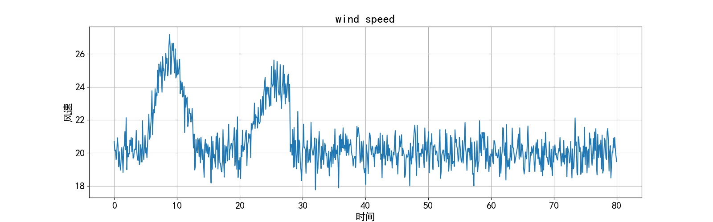
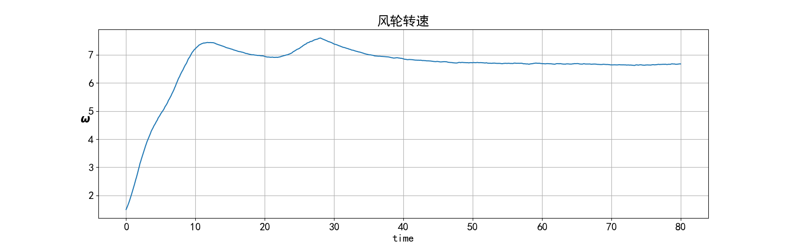
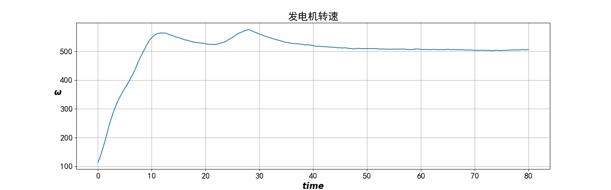
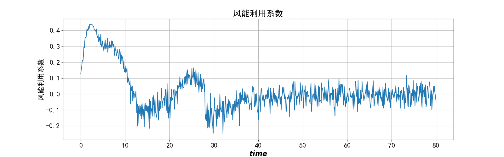
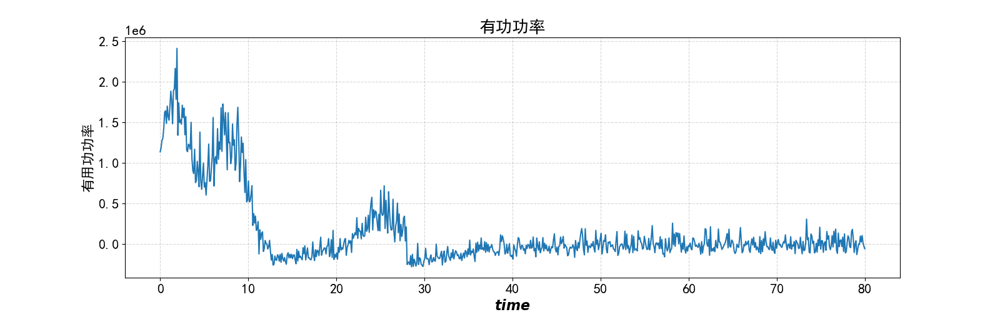
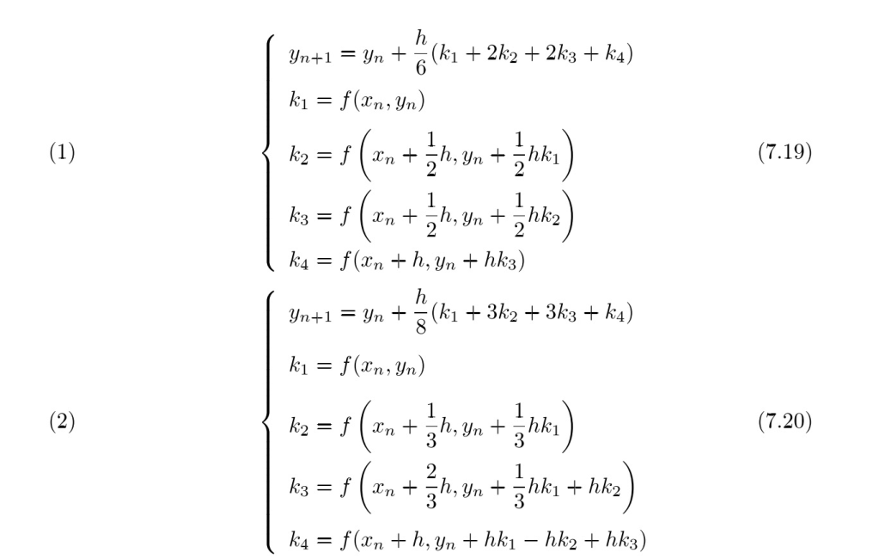

# 风力发电机Python建模仿真

[TOC]

## 0. 声明

风力发电系统建模仿真

 [基于MATLAB的风力发电系统仿真研究.pdf](C:\Users\YVYIKAI\Zotero\storage\GA56JNRP\基于MATLAB的风力发电系统仿真研究.pdf) 

T：时间

仿真时间为80秒

采样间隔为0.1秒

## 1. 模型

### 1. 风速模型（Wind）

Wind.wind_speed：输出风速

### 2. 风力机模型（WindTurbineRotor）

rho=1.2236：空气密度

R=38.5：风轮的半径

### 3. 传动系统模型（DriveTrain）

J_r = 3275300  # 风轮的转动惯量

J_g = 97.5  # 发电机的转动惯量

n = 75.76  # 齿轮箱传动比

### 4. 发电机模型（Generator）

self.g = 2  # 极对数

m_1 = 3  # 发电机定子相数

U_1 = 690  # 发电机电压

C_1 = 0.813  # 修正系数

omega_1 = 1500  # 发电机的同步转速

r_1 = 0.00169  # 定子绕组电阻

x_1 = 0.3692  # 定子绕组漏抗

r_21 = 0.0024  # 归算后转子绕组电阻

x_21 = 0.0359  # 归算后转子绕组漏抗

## 2. 函数

### 1. 风力机函数

wind_turbine_f(wind, omega, pitch_angle):

  输入

  wind: 风速

  omega: 风轮转速

  pitch_angle: 桨距角

  返回

  C_p: 功率利用系数

  T_r: 风轮获得的转矩

  P_s: 有功功率

### 2. 传动系统函数

drive_train_f(T_r, T_g, omega):

  输入

  T_r: 风轮获得的扭矩

  T_g: 发电机产生的反扭距

  返回

  omega: 风轮转速

  omega_g: 发电机转子转速

### 3. 发电机函数

generator_f(omega_g):

  输入

  omega_g: 发电机转子转速

  返回

  T_g: 发电机的反扭距

## 3. 结果

### 1. 仿真时间80秒， 基本风速20， 风轮初始转速1.5

这样有用功似乎是全部转化成了机械能，而没有输出电能，

电磁系统准备使用双馈异步发电机（Double-Fed Induction Generator)(DFIG)

> 求解微分方程可以用龙格库塔法或欧拉法

龙格-库塔法：

