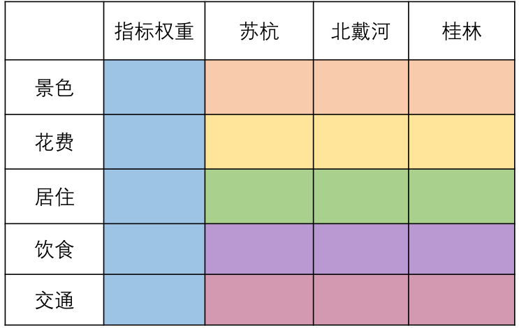
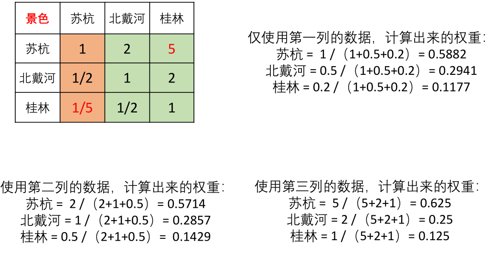
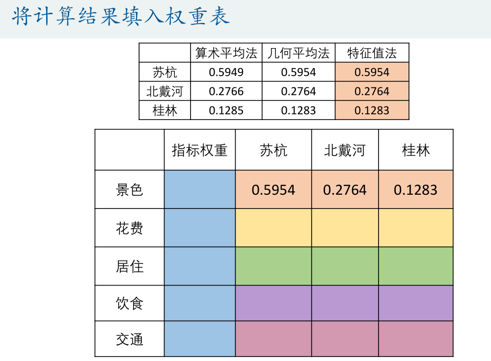
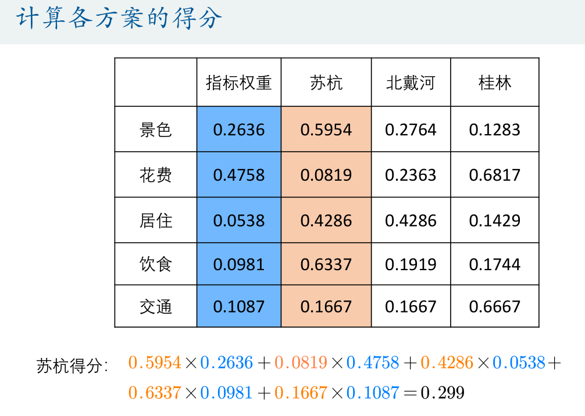
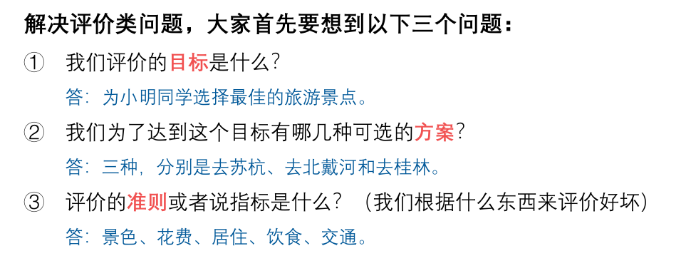
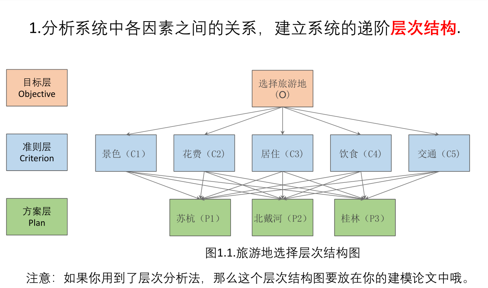
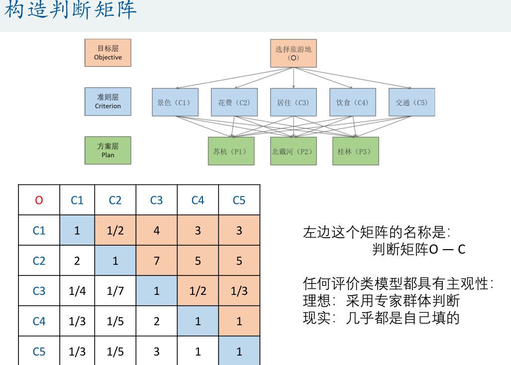
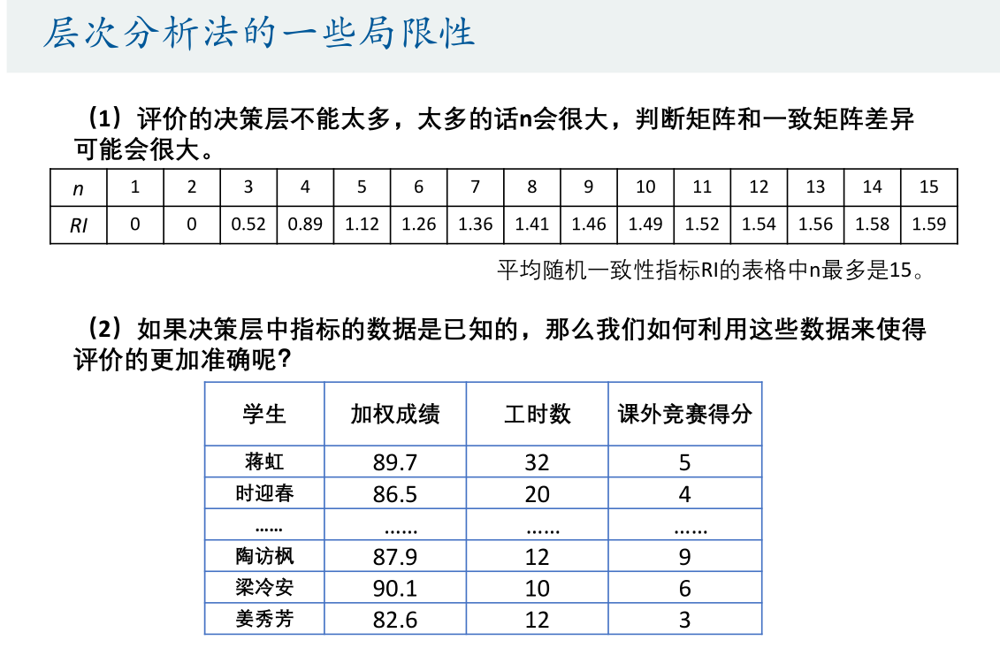

# 层次分析法

[数模新版视频课程第1讲.层次分析法.pdf](file/%E6%95%B0%E6%A8%A1%E6%96%B0%E7%89%88%E8%A7%86%E9%A2%91%E8%AF%BE%E7%A8%8B%E7%AC%AC1%E8%AE%B2.%E5%B1%82%E6%AC%A1%E5%88%86%E6%9E%90%E6%B3%95.pdf)

建模比赛中最基础的模型之一，其主要用于解决评价类问题（例如：选择哪种方案最好、哪位运动员或者员工表现的更优秀）。

- 主要是确定权重表格（同色的和为1）

| |指标权重|方案1|方案2|. . . .|
|---|---|---|---|---|
|准则1| | | | |
|准则2| | | | |
|. . . .| | | | |

- 得到判断矩阵，通过判断矩阵求出权重（准则层和方案层都要）
- 求权重之前要一致性检验
- 使用每一列求出权重

- 三个权重最后求平均数
- - 可以用算术平均法，几何平均法， 特征值法（matlab， python都有）

- 然后计算各个方案的得分

### 层次分析法的步骤

- 首先思考三个问题

1. 分析系统中各因素之间的关系，建立系统的递阶层次结构.
	
2. 对于同一层次的各元素关于上一层次中某一准则的重要
性进行两两比较，构造两两比较矩阵（判断矩阵）。
	

3. 由判断矩阵计算被比较元素对于该准则的相对权重，
并进行一致性检验（检验通过权重才能用）

    - 最好三种方法都用

4.根据权重矩阵计算得分，并进行排序。

### 层次分析法的局限性

- 评价的决策层不能太多，太多的话n会很大，判断矩阵和一致性矩阵差异可能会很大
- 如果决策层中指标的数据是已知的，那么我们如何利用这些数据来使得评价的更加准确呢？
- 就可以用topsis法

[test](file/数模新版视频课程第1讲.层次分析法.pdf)  
[test](./file/数模新版视频课程第1讲.层次分析法.pdf)

<www.baidu.com>

