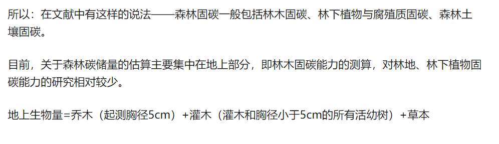
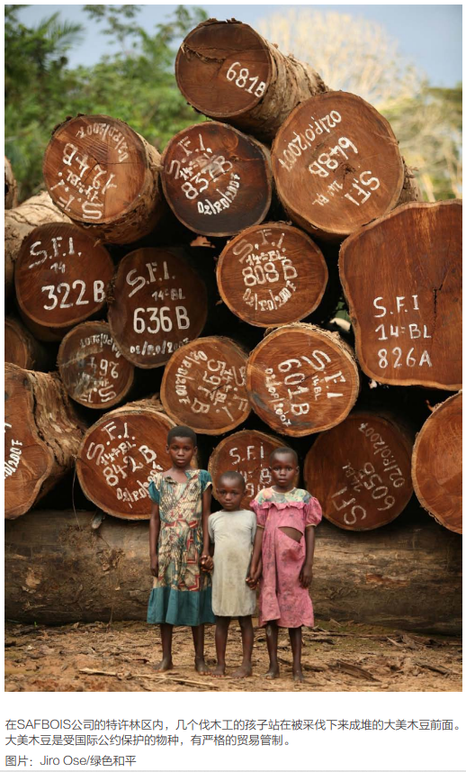

1. 差分方程或微分方程

2. 层次分析法，topsis（但没有现成数据）或综合评价

   先用层次分析法打分

   然后TPOPSIS评价

3. 使用微分方程预测或时间序列预测

4. 综合评价

6. 语文建模加上前面微分方程的一些结果

1. 便于维护
2. 经济价值
3. 地理位置要求
4. 固碳能力
5. 生物多样性
6. 面积要求
7. 对周围环境的影响
8. 观赏价值
9. 采伐难度
10. 病虫害
11. 生长速度
12. 涵养水源
13. 保育土壤
14. 净化大气环境
15. 森林游憩
11. 积累营养物质

## 管理计划：

长轮伐，中轮伐，短轮伐，最大生物量目标，最大增量目标等

森林类型主要 为 常绿 阔 叶林 、 针 阔 混交林 以 及灌丛，林龄较 小，蓄积和 收获量都较低，但增长较快，为世纪中后期我国森林增长最 为显著 的地 区，具有较大 的碳汇潜 力。

松树：10年

## 固碳：

## 思路：

1. 不能一刀切（因地制宜）
2. 抓住主要信息

3. 改变森林树木种类数量面积等

> 种植（品种，数量），生长速度和砍伐一般轮伐周期为10年或5年得到森林面积
>
> 对比森林对以下指标的影响 。。。
>
> 找不到就编
>
> 然后评价

可按规划做，经济效益，

就算用到的中国的数据也不要写中国

第一问：

综合考虑气候，地形，

内蒙古大兴安岭重点国有林区森林面积8.37万平方公里，活立木总蓄积10.33亿立方米。按照每生长1立方米林木，森林平均吸收约1.83吨二氧化碳计算，内蒙古大兴安岭重点国有林区森林碳储总量约为18.9亿吨，目前林区每年新增林业碳汇量约为4000万吨，是一个巨大的“储碳库”。

地理坐标介于北纬43°至北纬53°30′，东经117°20′至东经126°之间，全长1400多公里，均宽约200公里，海拔1100-1400米，

总面积32.72万平方公里主要树木有[兴安落叶松](https://baike.baidu.com/item/兴安落叶松/9778745)、[樟子松](https://baike.baidu.com/item/樟子松/515223)、[红皮云杉](https://baike.baidu.com/item/红皮云杉/9766304)、[白桦](https://baike.baidu.com/item/白桦/786)、[蒙古栎](https://baike.baidu.com/item/蒙古栎/7032821)、[山杨](https://baike.baidu.com/item/山杨/8627734)等。

西南林区：北纬21°08'～33°41'天然林区，林木储量不详，山脚和山顶高差悬殊，气候也随着高度变化，所以树的种类特别多山下和各地里生长着常绿阔叶树，山腰上是落叶阔叶树，再上面就是针叶树。主要树种有云杉、冷杉、高山栎、云南松等，

昆士兰热带雨林：S15 39 00，占地8940平方千米，自然资源十分丰富，雨水充足，最具代表性的特种植物有：楝树、香椿、贝壳杉、蒲葵、南洋杉、金合欢、生物多样性及其丰富，这里不仅拥有世界上最古老的树种，而且至少有483种稀有动物和83种面临面绝的动物在这个地区繁衍生息，其中有25种为特别稀有动物。

刚果雨林是世界第二大雨林，是原生林或天然次生林（非人工 林）总面积为178万平方千米。它位于非洲中部，刚果雨林还因其较高的生物多样性而得到广泛认可，其特点是600多种树种和1万种动物。它最著名的居民包括森林大象、大猩猩、黑猩猩、霍加皮和狮子。刚果盆地拥有仅次于[亚马孙河](https://baike.baidu.com/item/亚马孙河)盆地的世界第二大热带雨林，汇聚了极其丰富的物种，包括1万多种植物，400多种哺乳动物，1000多种鸟，200多种爬行动物。这里的大森林被称为地球最大的[物种基因库](https://baike.baidu.com/item/物种基因库/15829288)之一。

|      |        X1         |        X2         |         x3         |
| :--: | :---------------: | :---------------: | :----------------: |
| CCC  | 5.67548750213927  | 5.188754363005651 | 3.8682639199766924 |
| SSC  | 7.155463968267632 | 5.695541649423128 | 4.056772413044034  |
| SCC  | 6.90220811454598  | 5.907848732923894 | 3.7776279358789684 |
| CSS  | 6.207879306770831 | 5.45479784590194  | 4.506680594868532  |
| CSC  | 6.308458645301062 | 5.108679003258113 | 4.133432482028105  |
| SCS  | 6.784377035336018 | 5.829894629314391 | 4.128418122512355  |
| CCS  | 5.772037155816789 | 5.422261177174489 | 4.166525035388782  |
| SSS  | 7.662269304461171 | 6.409489595054484 | 4.654603691570974  |

各指标权重

| 指标 |   X1   |   X2   |   X3   |
| ---- | :----: | :----: | :----: |
| 权重 | 0.5088 | 0.2615 | 0.2297 |

综合评价值和排名次序

|               |    CCC     |    SSC     |    SCC     |    CSS     |    CSC     |    SCS     |    CCS     |  SSS   |
| ------------- | :--------: | :--------: | :--------: | :--------: | :--------: | :--------: | :--------: | :----: |
| 综合评价值    |   0.1119   |   0.1305   |   0.1273   |   0.1230   |   0.1194   |   0.1282   |   0.1162   | 0.1436 |
| 排名          |     8      |     2      |     4      |     5      |     6      |     3      |     7      |   1    |
| TOPSIS评价值  | 0.05869861 | 0.55436546 | 0.47768077 | 0.41890227 | 0.27829523 | 0.51960597 | 0.23540276 |   1    |
| 熵权加TOPOSIS | 0.0354774  | 0.66039534 | 0.56130655 | 0.33029552 | 0.29798941 | 0.54484198 | 0.14783471 |   1.   |

[0.0354774  0.66039534 0.56130655 0.33029552 0.29798941 0.54484198 0.14783471 1.        ]

TOPSIS

