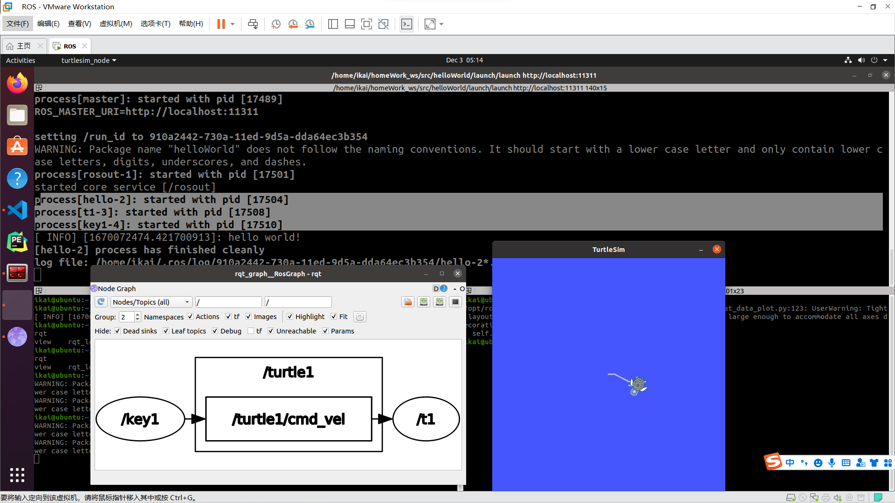

# 作业

[TOC]

## 1. launch

launch文件内容：

```shell
<launch>
    <node pkg="helloWorld" type="haha_node" name="hello" output="screen" />
    <node pkg="turtlesim" type="turtlesim_node" name="t1"/>
    <node pkg="turtlesim" type="turtle_teleop_key" name="key1" />
</launch>
```

运行后得到如下结果：



如图所示通过launch一次性运行了三个节点：小乌龟的两个节点：t1 和key1还有一个自己写的helloworld节点

通过rqt_graph的图像可以看出key1节点控制t1节点，

---

## 2. rosbag

(1) 首先创建两个小乌龟

~~~shell
rosrun turtlesim turtlesim_node  # 创建第一个

rosservice call /spawn "x: 0.0
y: 0.0
theta: 0.0
name: 'nihc'"   # 创建第二个
~~~

(2) 使用rosbag

1. 创建一个存放的目录

   ```shell
   mkdir bag 
   cd bag
   ```

2. 开始录制`rosbag record -a -O test1`

3. 让两个小乌龟做圆周运动

   ```shell
   ostopic pub -r 10 /turtle1/cmd_vel  geometry_msgs/Twist  '{linear:  {x: 1.0, y: 0.0, z: 0.0}, angular: {x: 0.0,y: 0.0,z: 1.0}}'  # 第一个
   
   ostopic pub -r 10 /nihc/cmd_vel  geometry_msgs/Twist  '{linear:  {x: 1.0, y: 0.0, z: 0.0}, angular: {x: 0.0,y: 0.0,z: 1.0}}'  # 第二个
   ```

4. 一段时间后**<kbd>Ctrl+C</kbd>**结束录制

   > 在创建的目录中会生成bag文件。

5. 回放文件

   ```shell
   rosbag play test1.bag
   ```

   > 乌龟按照录制时的轨迹运动，如图所示：

   

   

   ---

## 3. 阅读感受

文档写的通俗易懂，代码的注释和解释非常详细，也很容易理解和操作，整体来说还是挺好的，