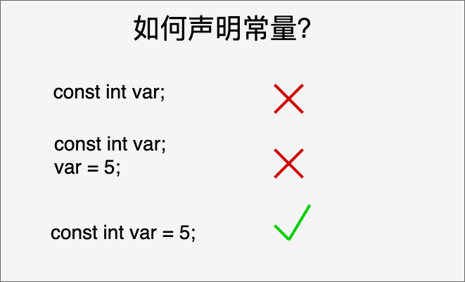

# C语言学习笔记

参考[C 语言教程 | 菜鸟教程 (runoob.com)](https://www.runoob.com/cprogramming/c-tutorial.html)

[TOC]

## 0. 简介

第一个实例：

```C
#include <stdio.h>

int main()
{
    /* 我的第一个C程序*/
    printf("Hello world! \n");
        
    return 0;
}
```

- 所有C语言程序都需要包含main()函数，代码从main() 函数开始执行
- `/*…*/`用于注释说明
- printf()是print, formatting用于格式化输出到屏幕printf()函数再‘stdio.h’头文件中声明
- stdio.h是一个头文件（标准输入输出头文件），
- #include 是一个预处理命令，用来引入头文件。当编译器遇到printf()函数是，如果没有找到stdio.h头文件，会发生编译错误。
- return 0;语句用于表示退出程序
- main()返回值必须为int类型

## 1. C环境配置

Linux中使用GCC编译命令：

`gcc helloWorld.c -o hello`: 生成可执行文件

未安装的话参考：[http://gcc.gnu.org/install/](http://gcc.gnu.org/install/)

windows中使用vs：

创建项目步骤：

1. 文件
2. 新建
3. 项目
4. 控制台应用
5. 解决方案哪里右击源文件
6. 添加
7. 新建项
8. c++文件
9. 正常编写程序即可

执行的步骤：

1. 生成
2. 生成解决方案
3. 调试
4. 开始执行不调试

## 2. C程序结构

### 主要包括以下部分：

1. 预处理器指令
2. 函数
3. 变量
4. 语句&表达式
5. 注释

例如：

```C
#include <stdio.h>

int main()
{
    /* 我的第一个C程序*/
    printf("Hello world! \n");
    
    return 0;
}
```

1. 程序的第一行 *#include <stdio.h>* 是预处理器指令，告诉 C 编译器在实际编译之前要包含 stdio.h 文件。
2. 下一行 *int main()* 是主函数，程序从这里开始执行。
3. 下一行 /*...*/ 将会被编译器忽略，这里放置程序的注释内容。它们被称为程序的注释。
4. 下一行 *printf(...)* 是 C 中另一个可用的函数，会在屏幕上显示消息 "Hello, World!"。
5. 下一行 **return 0;** 终止 main() 函数，并返回值 0。

### 编译&执行C程序

1. 保存一个文件为hello.c包含上述代码
2. 打开命令行进入所在目录
3. 键入`gcc hello.c`, 回车，编译代码
4. 若没有错误，会生成a.out 可执行文件
5. 键入a.out执行程序
6. 屏幕上显示‘hello world’

如果包含多个c代码源码文件：

```bash
$ gcc test1.c test2.c -o main.out
$ ./main.out
```

其中test1.c 和test2.c 是两个源代码文件

## 3. 基本语法

### 分号

再c程序中每个语句必须以分号结束。表明一个逻辑实体的结束。

### 注释

单行注释：

`// 单行注释`

多行注释：

```C
/* 
多行注释
多行注释
*/
```

> `/* */`可以单行或多行

### 标识符

以字母或下划线开头，里面可以有字母，数字，下划线不允许出现标点符号，区分大小写

### 关键字

下表列出了 C 中的保留字。这些保留字不能作为常量名、变量名或其他标识符名称。

| 关键字   | 说明                                                         |
| :------- | :----------------------------------------------------------- |
| auto     | 声明自动变量                                                 |
| break    | 跳出当前循环                                                 |
| case     | 开关语句分支                                                 |
| char     | 声明字符型变量或函数返回值类型                               |
| const    | 定义常量，如果一个变量被 const 修饰，那么它的值就不能再被改变 |
| continue | 结束当前循环，开始下一轮循环                                 |
| default  | 开关语句中的"其它"分支                                       |
| do       | 循环语句的循环体                                             |
| double   | 声明双精度浮点型变量或函数返回值类型                         |
| else     | 条件语句否定分支（与 if 连用）                               |
| enum     | 声明枚举类型                                                 |
| extern   | 声明变量或函数是在其它文件或本文件的其他位置定义             |
| float    | 声明浮点型变量或函数返回值类型                               |
| for      | 一种循环语句                                                 |
| goto     | 无条件跳转语句                                               |
| if       | 条件语句                                                     |
| int      | 声明整型变量或函数                                           |
| long     | 声明长整型变量或函数返回值类型                               |
| register | 声明寄存器变量                                               |
| return   | 子程序返回语句（可以带参数，也可不带参数）                   |
| short    | 声明短整型变量或函数                                         |
| signed   | 声明有符号类型变量或函数                                     |
| sizeof   | 计算数据类型或变量长度（即所占字节数）                       |
| static   | 声明静态变量                                                 |
| struct   | 声明结构体类型                                               |
| switch   | 用于开关语句                                                 |
| typedef  | 用以给数据类型取别名                                         |
| unsigned | 声明无符号类型变量或函数                                     |
| union    | 声明共用体类型                                               |
| void     | 声明函数无返回值或无参数，声明无类型指针                     |
| volatile | 说明变量在程序执行中可被隐含地改变                           |
| while    | 循环语句的循环条件                                           |

### C99 新增关键字

| `_Bool` | `_Complex` | `_Imaginary` | `inline` | `restrict` |
| ------- | ---------- | ------------ | -------- | ---------- |
|         |            |              |          |            |

### C11 新增关键字

| `_Alignas`       | `_Alignof`      | `_Atomic` | `_Generic` | `_Noreturn` |
| ---------------- | --------------- | --------- | ---------- | ----------- |
| `_Static_assert` | `_Thread_local` |           |            |             |
|                  |                 |           |            |             |

### 空格

和python差不多，很简单，没啥可记的


### 其他

-  １）c语言程序由函数构成，每个函数可以实现一个或多个功能。
-  ２）一个正规程序可以有多个函数，但是有且只有一个主函数。
-  ３）函数只有在被调用的时候才执行，主函数由系统调用执行。
-  ４）函数的格式必须按照规范书写。
-  ５）C 语言程序文件的后缀为 .c

## 4. 数据类型

数据类型值用于声明不同类型的变量或函数的一个官方的系统，变量的类型决定了变量的储存占用的空间，以及如何解释储存的为模式。

C中的类型分为以下几种：

1. 基本类型：

   算数类型，包含整数类型和浮点类型。

2. 枚举类型：

   也是算数类型，被用来定义再程序中只能赋予其一定的离散整数值的变量

3. void类型：

   类型说明符，void表示没有可用的值。

4. 派生类型：

   包括：指针类型，数组类型，结构类型，共用体类型和函数类型

### 整数类型

下表列出了关于标准整数类型的存储大小和值范围的细节：

| 类型           | 存储大小    | 值范围                                               |
| :------------- | :---------- | :--------------------------------------------------- |
| char           | 1 字节      | -128 到 127 或 0 到 255                              |
| unsigned char  | 1 字节      | 0 到 255                                             |
| signed char    | 1 字节      | -128 到 127                                          |
| int            | 2 或 4 字节 | -32,768 到 32,767 或 -2,147,483,648 到 2,147,483,647 |
| unsigned int   | 2 或 4 字节 | 0 到 65,535 或 0 到 4,294,967,295                    |
| short          | 2 字节      | -32,768 到 32,767                                    |
| unsigned short | 2 字节      | 0 到 65,535                                          |
| long           | 4 字节      | -2,147,483,648 到 2,147,483,647                      |
| unsigned long  | 4 字节      | 0 到 4,294,967,295                                   |

> 注意，各种类型的存储大小与系统位数有关，但目前通用的以64位系统为主。
>
> 以下列出了32位系统与64位系统的存储大小的差别（windows 相同）：
>
> 

为了得到某个类型或某个变量在特定平台上的准确大小，您可以使用 **sizeof** 运算符。表达式 *sizeof(type)* 得到对象或类型的存储字节大小。下面的实例演示了获取 int 类型的大小：

```C
#include <stdio.h>
#include <limits.h>

int main()
{
    printf("int 储存大小：$")
}
```

### 浮点类型

下表列出了关于标准浮点类型的存储大小、值范围和精度的细节：

| 类型        | 存储大小 | 值范围                 | 精度        |
| :---------- | :------- | :--------------------- | :---------- |
| float       | 4 字节   | 1.2E-38 到 3.4E+38     | 6 位有效位  |
| double      | 8 字节   | 2.3E-308 到 1.7E+308   | 15 位有效位 |
| long double | 16 字节  | 3.4E-4932 到 1.1E+4932 | 19 位有效位 |

头文件 float.h 定义了宏，在程序中可以使用这些值和其他有关实数二进制表示的细节。下面的实例将输出浮点类型占用的存储空间以及它的范围值：

```C
#include <stdio.h>
#include <float.h>

int main()
{
    printf("float 储存最大字节数： %lu \n", sizeof(float));
    printf("float 最小值：%E\n", FLT_MIN);
    printf("float 最大值：%E\n", FLT_MAX);
    printf("精度：%d\n", FLT_DIG);
    
    return 0;
}
```


### void类型

void类型指定没有可用的值，通常用于以下三种情况：

1. 函数返回为空：

   C中有各种函数都不返回值，或者可以说他们返回空。不返回值的函数的返回类型为空。例如`void exit(int status);`

2. 函数参数为空：

   C中有各种函数不接受任何参数，不带参数的函数可以接受一个void，例如`int rand(void);`

3. 指针指向void

   类型为`void *`的指针代表对象的地址，而不是类型，例如，内存分配函数`void * malloc(size_t size);`返回指向void的指针，可以转换为任何数据类型。

## 5. 变量

变量是程序可操作的储存区的名称

变量的名称可以由字母、数字和下划线字符组成。它必须以字母或下划线开头。大写字母和小写字母是不同的，因为 C 是大小写敏感的。基于前一章讲解的基本类型，有以下几种基本的变量类型：

| 类型   | 描述                                                         |
| :----- | :----------------------------------------------------------- |
| char   | 通常是一个字节（八位）, 这是一个整数类型。                   |
| int    | 整型，4 个字节，取值范围 -2147483648 到 2147483647。         |
| float  | 单精度浮点值。单精度是这样的格式，1位符号，8位指数，23位小数。 |
| double | 双精度浮点值。双精度是1位符号，11位指数，52位小数。 |
| void   | 表示类型的缺失。                                             |

C 语言也允许定义各种其他类型的变量，比如枚举、指针、数组、结构、共用体等等。

### 变量的定义

变量定义指定应该数据类型，并包含了该类型的一个或多个变量的列表如：

`type vaiable_list`

> type是有效的C数据类型，像char, w_char, int, float, double等，variable_list由一个或多个标识符名称组成，多个标识符之间用逗号分隔如：
>
> ```C
> int i, j, k;
> char c, ch;
> float f, salary;
> double d;
> ```
>
> 


也可以在声明时初始化：

`type variable_name = value;`如：

```C
extern int d = 3, f = 5;
int d = 3, f = 5;
byte z = 22;
char x = 'x'
```

### 变量声明

变量声明向编译器保证变量以指定的类型和名称存在，这样编译器在不需要知道变量完整细节的情况下也能继续进一步的编译。变量声明只在编译时有它的意义，在程序连接时编译器需要实际的变量声明。

变量的声明有两种情况：

- 1、一种是需要建立存储空间的。例如：int a 在声明的时候就已经建立了存储空间。
- 2、另一种是不需要建立存储空间的，通过使用extern关键字声明变量名而不定义它。 例如：extern int a 其中变量 a 可以在别的文件中定义的。
- 除非有extern关键字，否则都是变量的定义。

```c
extern int i; //声明，不是定义
int i; //声明，也是定义
```

### 实例

```C
#include <stdio.h>

// 函数外定义变量x, y
int x;
int y;
int addtwonum()
{
    //函数内声明变量x, y为外部变量
    extern int x;
    extern int y;
    // 给外部变量（全局变量）x和y赋值
    x = 1;
    y = 2;
    return x + y;
}

int main()
{
    int result;
    // 调用函数addtwonum
    result = addtwonum();
    
    printf("result为：%d", result);
    
}
```

如果需要在一个源文件中引用另外一个源文件中定义的变量，只需要在引用的文件中将变量加上extern关键字

addtwonum.c代码：

```C
#include <stdio.h>
/*外部变量声明*/
extern int x;
extern int y;
int addtwonum()
{
    return x+y;
}
```

test.c代码：

```C
#include <stdio.h>

int x = 1;
int y = 2;
int addtwonum();
int main()
{
    int result;
    result = addtwnum();
    printf("result为：%d", result);
    return 0;
}
```

执行后输出：

```c
result为：3
```


### C中的左值和右值

1. **左值（lvalue）：**指向内存位置的表达式被称为左值（lvalue）表达式。左值可以出现在赋值号的左边或右边。
2. **右值（rvalue）：**指的是存储在内存中某些地址的数值。右值是不能对其进行赋值的表达式，也就是说，右值可以出现在赋值号的右边，但不能出现在赋值号的左边。

变量是左值，因此可以出现在赋值号的左边。数值型的字面值是右值，因此不能被赋值，不能出现在赋值号的左边。下面是一个有效的语句：

```
int g = 20;
```

但是下面这个就不是一个有效的语句，会生成编译时错误：

```
10 = 20;
```

### 其他

1. 当要保存数据时要用lvalues

2. 当要读取数据时要用rvalues

3. C中最开始似乎没有定义布尔类型，判断真假时以0为假，非0为真，现在可以用了：

   ```C
   // 导入stdbool.h来使用布尔类型
   #include <stdbool.h>
   #include <stdio.h>
   
   //计算n1, n的值在main中定义
   int main(void)
   {
       int n = 10;
       int sum = 1;
       bool flag = false;
       
       int num = n;
       while(!flag)
       {
           sum = sum * (num--);
           if (sum == 1)
           {
               flag = true;
           }
       }
       printf("%d的叠乘值为：\n", n, sum);
       return 0;
   }
   ```
   
4. 全局变量和局部变量在内存中的区别：全局变量包括外部变量和静态变量保存在内存的全局存储区中，占用静态的存储单元；局部变量保存在栈中，只有在所在函数被调用时才动态地为变量分配存储单元。C语言经过编译后将内存分为1.栈（stack）2. 堆（heap）3. 全局（静态）储存区4. 文字常量区5. 程序代码区
   
   
   
## 6. 常量

   常量是固定值，在程序执行期间不会改变。这些固定的值，又叫做**字面量**。

   常量可以是任何的基本数据类型，比如整数常量、浮点常量、字符常量，或字符串字面值，也有枚举常量。

   **常量**就像是常规的变量，只不过常量的值在定义后不能进行修改。

### 整数常量

   整数常量可以时十进制，八进制或十六进制的常量。前缀指定基数：0x或0X表示十六进制，0表示把进制，不带前缀默认表示十进制。

   整数常量也可以带一个后缀，后缀是 U 和 L 的组合，U 表示无符号整数（unsigned），L 表示长整数（long）。后缀可以是大写，也可以是小写，U 和 L 的顺序任意。

   以下是各种类型的整数常量的实例：

   ```
   85         /* 十进制 */
   0213       /* 八进制 */
   0x4b       /* 十六进制 */
   30         /* 整数 */
   30u        /* 无符号整数 */
   30l        /* 长整数 */
   30ul       /* 无符号长整数 */
   ```

### 浮点常量

由整数部分，小数点，小数部分和指数部分组成。可以使用指数形式或小数形式表示浮点数常量，带符号的指数是用e或E引入的。

### 字符常量

字符常量是括在单引号中例如‘x’可以储存在char类型的简单变量中。

   字符常量可以是一个普通的字符如‘x’， 一个转义序列如‘\t’或一个通用的字符如：‘\u02C0’。

有一些特殊的字符当前面有反斜杠时就有特殊的含义，下表给出了一些这样的转义序列码：

| 转义序列   | 含义                       |
| :--------- | :------------------------- |
| \\         | \ 字符                     |
| \'         | ' 字符                     |
| \"         | " 字符                     |
| \?         | ? 字符                     |
| \a         | 警报铃声                   |
| \b         | 退格键                     |
| \f         | 换页符                     |
| \n         | 换行符                     |
| \r         | 回车                       |
| \t         | 水平制表符                 |
| \v         | 垂直制表符                 |
| \ooo       | 一到三位的八进制数         |
| \xhh . . . | 一个或多个数字的十六进制数 |
|            |                            |

实例：

```C
#include <stdio.h>

int main()
{
    prntf("Hello world\tWorld\n\n");
    
    return 0;
}
```

> ```
> Hello	World
> ```


### 字符串常量

字符串字面值或常量是括在双引号 "" 中的。一个字符串包含类似于字符常量的字符：普通的字符、转义序列和通用的字符。

可以使用空格做分隔符，把一个很长的字符串常量进行分行。

下面的实例显示了一些字符串常量。下面这三种形式所显示的字符串是相同的:

```
"hello, dear"

"hello, \

dear"

"hello, " "d" "ear"
```

### 定义常量

有两种简单的定义常量的方法：

1. 使用#define预处理器。
2. 使用const关键字。

#### #define预处理器

使用#define预处理器的形式：

`#define identifier value`

具体实例：

```C
#include <stdio.h>

#define LENGTH 10
#define WIDTH 5
#define NEWLINE '\n'

int main()
{
    int area;
    area = LENGTH * WIDTH;
    printf("value of area: %d", area);
    
    return 0;
}
```

#### const关键字

使用const前缀声明指定类型的常量格式如下：

`const type variable = value;`




实例：

```C
#include <stdio.h>

int main()
{
    const int LENGTH = 10;
    const int WIDTH = 5;
    const char NEWLINE = '\n';
    int area;
    
    area = LENGTH * WIDTH;
    printf("value of area :%d", area);
    
    return 0;
}
```

> 和上一个输出一样
>
> 最好把常量定义为大写字母形式。

### 其他

1. #define和const不太一样， 似乎const可以节省空间，避免不必要的内存分配

2. **四种进制说明：**

   在二进制中只有 0、1 两种情况。二进制是逢 2 就进位，所有数字中没可能有 2 或大于 2 的数字，

   在八进制中有 0、1、2、3、4、5、6、7这八种情况。八进制是逢8就进位，所有数字中没可能有8或大于8的数字。

   在十进制中有0、1、2、3、4、5、6、7、8、9这十种情况。十进制是逢10就进位，所有数字中有0~9都有

   在十六进制中有 0、1、2、3、4、5、6、7、8、9、A、B、C、D、E、F，其中 A 表示 10；B 表示 11；C 表示 12；D 表示 13；E 表示 14；F 表示 15。十六进制数字中含有 A~F 字母，它是 0~9+A~F

## 7. 储存类

存储类定义 C 程序中变量/函数的范围（可见性）和生命周期。这些说明符放置在它们所修饰的类型之前。下面列出 C 程序中可用的存储类：

- auto
- register
- static
- extern

### auto储存类

auto储存类时所有局部变量的储存类

```C
{
    int mount;
    auto int month;
}
```

### register储存类

**register** 存储类用于定义存储在寄存器中而不是 RAM 中的局部变量。这意味着变量的最大尺寸等于寄存器的大小（通常是一个字），且不能对它应用一元的 '&' 运算符（因为它没有内存位置）。

```
{
   register int  miles;
}
```

寄存器只用于需要快速访问的变量，比如计数器。还应注意的是，定义 'register' 并不意味着变量将被存储在寄存器中，它意味着变量可能存储在寄存器中，这取决于硬件和实现的限制。

### static储存类

**static** 存储类指示编译器在程序的生命周期内保持局部变量的存在，而不需要在每次它进入和离开作用域时进行创建和销毁。因此，使用 static 修饰局部变量可以在函数调用之间保持局部变量的值。

static 修饰符也可以应用于全局变量。当 static 修饰全局变量时，会使变量的作用域限制在声明它的文件内。

全局声明的一个 static 变量或方法可以被任何函数或方法调用，只要这些方法出现在跟 static 变量或方法同一个文件中。

以下实例演示了 static 修饰全局变量和局部变量的应用：

```C
#include <stdio.h>

// 函数声明
void func1(void);

static int count = 10;  // 全局变量 - static 是默认的

int main()
{
    while (count--){
        func1();
    }
    return 0;
}

void func1()
{
    /* 'thingy'是'func1'的局部变量 - 只初始化一次
     * 每次调用函数'func1' 'thingy'值不会重置。
      */
    static int thingy = 5;
    thingy++;
    printf("thingy 为%d, count为%d\n", thingy, count);
}
```


### extern类

**extern** 存储类用于提供一个全局变量的引用，全局变量对所有的程序文件都是可见的。当您使用 **extern** 时，对于无法初始化的变量，会把变量名指向一个之前定义过的存储位置。

当您有多个文件且定义了一个可以在其他文件中使用的全局变量或函数时，可以在其他文件中使用 *extern* 来得到已定义的变量或函数的引用。可以这么理解，*extern* 是用来在另一个文件中声明一个全局变量或函数。

extern 修饰符通常用于当有两个或多个文件共享相同的全局变量或函数的时候，如下所示：

**第一个文件：main.c:**

```C
#include <stdio.h>

int count;
extern void write_extern();

int main()
{
    count = 5;
    write_extern();
}
```


**第二个文件：support.c**

```C
#include <stdio.h>

extern int count;

void write_extern(void)
{
    printf("count is %d\n", count);
}
```


在这里，第二个文件中的 *extern* 关键字用于声明已经在第一个文件 main.c 中定义的 *count*。现在 ，编译这两个文件，如下所示：

```
 $ gcc main.c support.c
```

这会产生 **a.out** 可执行程序，当程序被执行时，它会产生下列结果：

```
count is 5
```

### 其他

1. 就是在一个文件中需要用到另一个文件中的变量或函数就需要加一个extern


## 8. C运算符

运算符是一种告诉编译器执行特定的数学或逻辑操作的符号。C 语言内置了丰富的运算符，并提供了以下类型的运算符：

- 算术运算符
- 关系运算符
- 逻辑运算符
- 位运算符
- 赋值运算符
- 杂项运算符

### 算术运算符

下表显示了 C 语言支持的所有算术运算符。假设变量 **A** 的值为 10，变量 **B** 的值为 20，则：

| 运算符 | 描述                             | 实例             |
| :----- | :------------------------------- | :--------------- |
| +      | 把两个操作数相加                 | A + B 将得到 30  |
| -      | 从第一个操作数中减去第二个操作数 | A - B 将得到 -10 |
| *      | 把两个操作数相乘                 | A * B 将得到 200 |
| /      | 分子除以分母                     | B / A 将得到 2   |
| %      | 取模运算符，整除后的余数         | B % A 将得到 0   |
| ++     | 自增运算符，整数值增加 1         | A++ 将得到 11    |
| --     | 自减运算符，整数值减少 1         | A-- 将得到 9     |
|        |                                  |                  |

实例：

```C
#include <stdio.h>

int main()
{
    int a = 21;
    int b = 10;
    int c;
    
    c = a + b;
    printf("Line 1 - c 的值是%d\n", c);
    c = a * b;
    printf("Line 2 - c 的值是%d\n", c)
}
```

### 关系运算符

下表显示了 C 语言支持的所有关系运算符。假设变量 **A** 的值为 10，变量 **B** 的值为 20，则：

| 运算符 | 描述                                                         | 实例            |
| :----- | :----------------------------------------------------------- | :-------------- |
| ==     | 检查两个操作数的值是否相等，如果相等则条件为真。             | (A == B) 为假。 |
| !=     | 检查两个操作数的值是否相等，如果不相等则条件为真。           | (A != B) 为真。 |
| >      | 检查左操作数的值是否大于右操作数的值，如果是则条件为真。     | (A > B) 为假。  |
| <      | 检查左操作数的值是否小于右操作数的值，如果是则条件为真。     | (A < B) 为真。  |
| >=     | 检查左操作数的值是否大于或等于右操作数的值，如果是则条件为真。 | (A >= B) 为假。 |
| <=     | 检查左操作数的值是否小于或等于右操作数的值，如果是则条件为真。 | (A <= B) 为真。 |

和python都差不多

### 逻辑运算符

下表显示了 C 语言支持的所有关系逻辑运算符。假设变量 **A** 的值为 1，变量 **B** 的值为 0，则：

| 运算符 | 描述                                                         | 实例              |
| :----- | :----------------------------------------------------------- | :---------------- |
| &&     | 称为逻辑与运算符。如果两个操作数都非零，则条件为真。         | (A && B) 为假。   |
| \|\|   | 称为逻辑或运算符。如果两个操作数中有任意一个非零，则条件为真。 | (A \|\| B) 为真。 |
| !      | 称为逻辑非运算符。用来逆转操作数的逻辑状态。如果条件为真则逻辑非运算符将使其为假。 | !(A && B) 为真。  |
