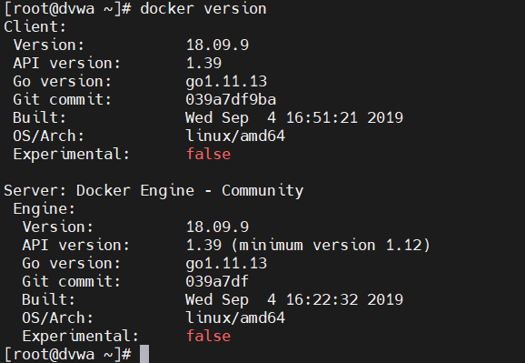
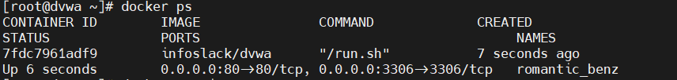
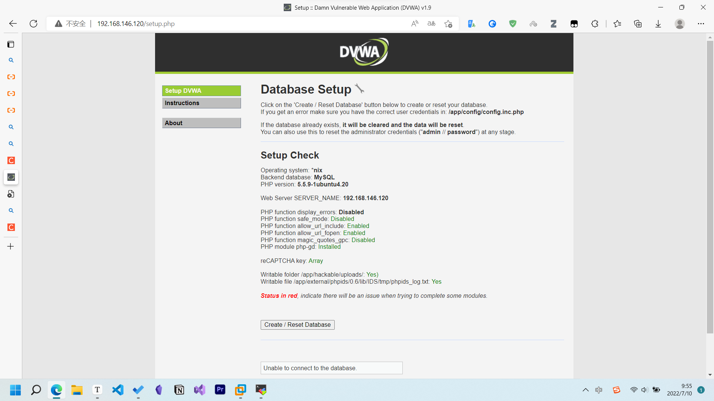

# Linux


[TOC]

## 常见命令和技巧

参考[Linux 常用命令学习 | 菜鸟教程 (runoob.com)](https://www.runoob.com/w3cnote/linux-common-command-2.html)

将数据同步写入硬盘中： sync

su - : 变成root 然后exit回到原用户

关机： shutdown，`shutdown now`: 立刻关机，否则一分钟后关机

复制与粘贴技巧：双击可复制文件名，单击中键将其粘贴

可以通过==info==和==man==和==/usr/share/doc==文档来获取帮助如果知道某个指令但忘了相关指令和参数可以用`xxx --help`查询

reset：重新初始化终端

logout：重新登录

hostnamectl set-hostname dvwa：修改名

clear: 清屏

==rm -rf /\*==: 🤣

输入前两个字母然后按两次[TAB]可以显示所有以此开头的命令

### 输出重定向

可以将结果输出到其他文件

重定向操作符：`>`

```shell
ls -l /usr/bin > ls-output.txt  # 将ls的结果输出到ls-output.txt
```

> 会覆盖原文件
>
> 使用`>>`就是追加

将标准输出和标准错误输出到文件

```shell
ls -l /bin/usr/ &> ls-output.txt
```

### Ubuntu系统安装和卸载软件

1. 离线安装

   下载deb格式安装包文件

   `sudo dpkg -i xxx.deb`: 安装包

   `sudo dpkg -r packageName`: 删除包

2. apt安装和卸载

   ```shell
   sudo apt update # 更新源
   sudo apt install package  # 安装包
   sudo apt remove package  # 删除包
   ```

   获取所有已经安装的列表

   `sudo apt list --installed`

   ==remove==命令卸载指定软件包，但是留下一些包文件。如果你想卸载软件包，包括它的文件，使用==purge==替换==remove==：

   ```shell
   sudo apt purge package_name
   sudo apt purge ros-*
   ```

3. 卸载Snap软件包

   列出所有的snap软件包

   `snap list`

   卸载：`sudo snap remove package_name`

4. 移除不再使用的软件包`sudo apt autoremove`

### yum常用命令：

> yum常用命令
> 1. 列出所有可更新的软件清单命令：yum check-update
>
> 2. 更新所有软件命令：yum update
>
> 3. 仅安装指定的软件命令：yum install <package_name>
>
> 4. 仅更新指定的软件命令：yum update <package_name>
>
> 5. 列出所有可安裝的软件清单命令：yum list
>
> 6. 删除软件包命令：yum remove <package_name>
>
> 7. 查找软件包命令：yum search <keyword>
>
> 8. 清除缓存命令:
>
> yum clean packages: 清除缓存目录下的软件包
>
> yum clean headers: 清除缓存目录下的 headers
>
> yum clean oldheaders: 清除缓存目录下旧的 headers
>
> yum clean, yum clean all (= yum clean packages; yum clean oldheaders) :清除缓存目录下的软件包及旧的 headers

### 线上查询和帮助（两个）

man(manual)：查看命令帮助命令的词典

help：查看Linux系统内置命令

### 文件和目录操作（18个）

ls：查看当前目录内容和内容属性的信息（通常按照字母升序排列）

```shell
-l: 以列表格式输出详细的信息（长格式）
-a --all: 列出所有文件包括隐藏的
-r, --reverse: 以字母降序排列
-S: 以文件大小排列
开头第一个字母是d就是目录，是-就是文件
```

cd：改变当前工作目录

```shell
.：当前目录
..：上一级目录
/：根目录
~：主目录/家目录，直接输入cd也会回到家目录
-：切换回上一个工作目录
```

cp：复制/拷贝文件或目录

```shell
-r: 复制目录级目录内的所有项目
```


pwd：显示当前工作路径

mv：移动文件或目录/重命名

```shell
mv test.log test1.txt  # 重命名
-i：移动前询问
```


rm：删除目录或文件：

```shell
-r: 将目录以下的内容逐一删除
-f: 强制删除，不需要确认
-i: 删除前逐一询问确认 rm -rfi day01
```


mkdir：创建一个（或多个）空的目录`mkdir sec mca`

```shell
-p: 逐层去创建： mkdir -p day01/images
```


rmdir：删除一个空目录（一般不用）

touch：创建一个空文件

rename：重命名文件

find：文件查找

tree：以树形结构显示

md5sum：

lsattr

file：显示文件类型`file filename`

等

### 查看文件内容及内容处理（21个）

cat：查看文件内容

```shell
cat file1 file2 > file  # 将几个文件合并为一个文件
-b: 对非空行输出行号
-n: 输出所有行号
```


more：类似于cat，more 会以一页一页的显示，按空白键（space）就往下一页显示，按 b 键就会往回（back）一页显示。：

```
+n      从笫 n 行开始显示
-n       定义屏幕大小为n行
+/pattern 在每个档案显示前搜寻该字串（pattern），然后从该字串前两行之后开始显示 
-c       从顶部清屏，然后显示
-d       提示“Press space to continue，’q’ to quit（按空格键继续，按q键退出）”，禁用响铃功能
-l        忽略Ctrl+l（换页）字符
-p       通过清除窗口而不是滚屏来对文件进行换页，与-c选项相似
-s       把连续的多个空行显示为一行
-u       把文件内容中的下画线去掉
```

less：于more类似，查看文本文件`less filename`按q建退出

head：查看前几行

```shell
head 1.log -n 20  # 显示文件的钱20行
head -c 20 1.log  # 显示前20字节
head -n -10 1.log  # 显示最后10行
```


tail：查看最后几行

cut：

wc：统计行数

diff：比较差异的

vimdiff：

tr

vi,vim：用vi/vim编辑

grep： 过滤字符

rev

等

### 文件的压缩和解压（4个）

tar: 压缩和解压文件

```shell
-c 建立新的压缩文件
-f 指定压缩文件
-r 添加文件到现有的压缩包中
-u 添加改了和现有的文件到压缩包中
-x 从压缩包抽取文件
-t 显示压缩文件中的内容
-z 支持gzip压缩
-j
-Z
-v
```

实例：

```shell
tar -cvf log.tar 1.log, 2.log  # 将文件全部打包成tar包 或者tar -cvf log.*

```


unzip

gzip

zip

rar

等

### 文件传输

scp：不支持断点续传

ssh

rsync：增量支持断点

### 信息显示的命令

uname

hostname

dmesg

uptime

stat：显示状态

du：磁盘空间，对文件和目录磁盘使用的空间的查看

```
-a 显示目录中所有文件大小
-k 以KB为单位显示文件大小
-m 以MB为单位显示文件大小
-g 以GB为单位显示文件大小
-h 以易读方式显示文件大小
-s 仅显示总计
-c或--total  除了显示个别目录或文件的大小外，同时也显示所有目录或文件的总和
```

df: 显示磁盘使用情况

```
-a 全部文件系统列表
-h 以方便阅读的方式显示信息
-i 显示inode信息
-k 区块为1024字节
-l 只显示本地磁盘
-T 列出文件系统类型
```

top

free：查看内存

date

cal

等

### 文件搜索和查找

find: 世纪搜索硬盘查询文件名称

which : 查看可执行文件的位置

whereis : 查看文件的位置

locate: 配合数据库查看文件位置

```shell
locate /etc/sh  # 在etc目录下所有以sh开头的文件
```


### 用户管理

useradd

userdel

usermod

groupadd

id

passwd

chage

su

visudo：/etc/sudoers

sudo

### 基本的网络管理

ip

ping

route

telnet

ssh

scp

wget

curl 

ifconfig

netstat

ss

ifup

ifdown

nslookup

dig

> ifconfig 和ip address 可以显示ip地址

### 进阶网络命令

nmap

lsof 

iftop

mail

host

tcpdump

traceroute

### 磁盘相关命令

fdisk

mount

unmount

fsck

dd

mkfs

mkswap

swapon

swapoff

sync

等

### 系统权限以及用户授权相关

chown 

chmod: 改变文件或目录的访问权限

常用参数：

```
-c 当发生改变时，报告处理信息
-R 处理指定目录以及其子目录下所有文件
```

权限范围：

```
u ：目录或者文件的当前的用户
g ：目录或者文件的当前的群组
o ：除了目录或者文件的当前用户或群组之外的用户或者群组
a ：所有的用户及群组
```

权限代号：

```
r ：读权限，用数字4表示
w ：写权限，用数字2表示
x ：执行权限，用数字1表示
- ：删除权限，用数字0表示
s ：特殊权限
```

实例：

```shell
chmod a+x t.log  # 增加所有用户可执行权限
```


chgrp

umask

### 查看系统登陆信息

w

who

whoai 

last

lastlog

users

### 系统内置命令

echo

date

alias  rm

rpm

yum

printf

clear

history

time

nc

exec

export

type

等

### 系统管理和监控

systemctl enable

chkconfig

vmstat

mpstat

iostat

sar：相当于任务管理器

ipcs

service

iptable

firewalld

### 进程管理

ps

pstree

pgrep

kill

pkill

killall

jobs

fg

bg

exit

ctrl+d

nice

runlevel

## 系统目录结构


以下是对这些目录的解释：

- **/bin**：
  bin 是 Binaries (二进制文件) 的缩写, 这个目录存放着最经常使用的命令。

- **/boot：**
  这里存放的是启动 Linux 时使用的一些核心文件，包括一些连接文件以及镜像文件。

- **/dev ：**
  dev 是 Device(设备) 的缩写, 该目录下存放的是 Linux 的外部设备，在 Linux 中访问设备的方式和访问文件的方式是相同的。

- **/etc：**
  etc 是 Etcetera(等等) 的缩写,这个目录用来存放所有的系统管理所需要的配置文件和子目录。

- **/home**：
  用户的主目录，在 Linux 中，每个用户都有一个自己的目录，一般该目录名是以用户的账号命名的，如上图中的 alice、bob 和 eve。

- **/lib**：
  lib 是 Library(库) 的缩写这个目录里存放着系统最基本的动态连接共享库，其作用类似于 Windows 里的 DLL 文件。几乎所有的应用程序都需要用到这些共享库。

- **/lost+found**：
  这个目录一般情况下是空的，当系统非法关机后，这里就存放了一些文件。

- **/media**：
  linux 系统会自动识别一些设备，例如U盘、光驱等等，当识别后，Linux 会把识别的设备挂载到这个目录下。

- **/mnt**：
  系统提供该目录是为了让用户临时挂载别的文件系统的，我们可以将光驱挂载在 /mnt/ 上，然后进入该目录就可以查看光驱里的内容了。

- **/opt**：
  opt 是 optional(可选) 的缩写，这是给主机额外安装软件所摆放的目录。比如你安装一个ORACLE数据库则就可以放到这个目录下。默认是空的。

- **/proc**：
  proc 是 Processes(进程) 的缩写，/proc 是一种伪文件系统（也即虚拟文件系统），存储的是当前内核运行状态的一系列特殊文件，这个目录是一个虚拟的目录，它是系统内存的映射，我们可以通过直接访问这个目录来获取系统信息。
  这个目录的内容不在硬盘上而是在内存里，我们也可以直接修改里面的某些文件，比如可以通过下面的命令来屏蔽主机的ping命令，使别人无法ping你的机器：

  ```
  echo 1 > /proc/sys/net/ipv4/icmp_echo_ignore_all
  ```

- **/root**：
  该目录为系统管理员，也称作超级权限者的用户主目录。

- **/sbin**：
  s 就是 Super User 的意思，是 Superuser Binaries (超级用户的二进制文件) 的缩写，这里存放的是系统管理员使用的系统管理程序。

- **/selinux**：
   这个目录是 Redhat/CentOS 所特有的目录，Selinux 是一个安全机制，类似于 windows 的防火墙，但是这套机制比较复杂，这个目录就是存放selinux相关的文件的。

- **/srv**：
   该目录存放一些服务启动之后需要提取的数据。

- **/sys**：

  这是 Linux2.6 内核的一个很大的变化。该目录下安装了 2.6 内核中新出现的一个文件系统 sysfs 。

  sysfs 文件系统集成了下面3种文件系统的信息：针对进程信息的 proc 文件系统、针对设备的 devfs 文件系统以及针对伪终端的 devpts 文件系统。

  该文件系统是内核设备树的一个直观反映。

  当一个内核对象被创建的时候，对应的文件和目录也在内核对象子系统中被创建。

- **/tmp**：
  tmp 是 temporary(临时) 的缩写这个目录是用来存放一些临时文件的。

- **/usr**：
   usr 是 unix shared resources(共享资源) 的缩写，这是一个非常重要的目录，用户的很多应用程序和文件都放在这个目录下，类似于 windows 下的 program files 目录。

- **/usr/bin：**
  系统用户使用的应用程序。

- **/usr/sbin：**
  超级用户使用的比较高级的管理程序和系统守护程序。

- **/usr/src：**
  内核源代码默认的放置目录。

- **/var**：
  var 是 variable(变量) 的缩写，这个目录中存放着在不断扩充着的东西，我们习惯将那些经常被修改的目录放在这个目录下。包括各种日志文件。

- **/run**：
  是一个临时文件系统，存储系统启动以来的信息。当系统重启时，这个目录下的文件应该被删掉或清除。如果你的系统上有 /var/run 目录，应该让它指向 run。

在 Linux 系统中，有几个目录是比较重要的，平时需要注意不要误删除或者随意更改内部文件。

**/etc**： 上边也提到了，这个是系统中的配置文件，如果你更改了该目录下的某个文件可能会导致系统不能启动。

**/bin, /sbin, /usr/bin, /usr/sbin**: 这是系统预设的执行文件的放置目录，比如 **ls** 就是在 **/bin/ls** 目录下的。

值得提出的是 **/bin**、**/usr/bin** 是给系统用户使用的指令（除 root 外的通用用户），而/sbin, /usr/sbin 则是给 root 使用的指令。

**/var**： 这是一个非常重要的目录，系统上跑了很多程序，那么每个程序都会有相应的日志产生，而这些日志就被记录到这个目录下，具体在 /var/log 目录下，另外 mail 的预设放置也是在这里。

## 常用软件

vim: 文本编辑器

wget: 下载工具

lrzsz: windows向Linux上传下载工具

tree

centOS安装`yum install -y vim tree lrzsz wget curl unzip`

## 更改软件源

1. cd /etc/yum.repos.d/CentOS-Base.repo
2. mv CentOS.Base.repo CentOS.Base.repo.bak
3. 下载阿里源：wget -O /etc/yum.repos.d/CentOS-Base.repo http://mirrors.aliyun.com/repo/CentOS-7.repo
4. yum clean all
5. yum makecache

## 修改静态ip地址
指定静态ip地址

网卡配置文件  centOS系统中`/etc/sysconfig/network-scripts/ifcfg-ens33`网卡配置文件


修改网络配置文件


## 关闭一些服务

关闭防火墙：

systemctl stop firewalld

systemctl disable firewalld

systemctl stop NetworkManager

systemctl disable NetworkManager

## 不能上网排查流程

1. 检查数据链路/传输介质
2. ping 网关（路由器/NAT）ping 10.0.0.2 自己的网关
3. ping DNS服务器 ping www.baidu.com
4. ping 114.114.114.114
5. 检查网卡和配置文件/防火墙是否正确

## kali Linux安装注意事项

## Docker

### 安装

1. 内核版本3.10以上

2. 安装依赖项：yum install -y yum-utils device-mapper-persistent-data  lvm2

3. 配置阿里云源：yum-config-manager --add-repo http://mirrors.aliyun.com/docker-ce/linux/centos/docker-ce.repo

4. yum list docker-ce --showduplicates | sort -r

5. 安装指定版本yum install -y docker-ce-18.09.9 docker-ce-cli-18.09.9

   安装最新版本yum install -y docker-ce

6. 启动systemctl start docker

   开机自启动systemctl enable docker

7. 查看版本docker version得到客户端和服务端都是18.09.9


### 优化

国内镜像加速：

vim /etc/docker/daemon.json

添加`{  "registry-mirrors": ["https://eq0plkca.mirror.aliyuncs.com"] }`退出

sudo systemctl daemon-reload 

sudo systemctl restart docker

### 配置

1. 模板机关机后克隆一个新的虚拟机

2. 改名hostnamectl set-hostname dvwa

3. xshell远程连接

4. docker version验证是否启动了（客户端和服务端都有）

   

5. docker镜像的用法docker pull infoslack/dvwa

6. docker images 查看是否下载成功

7. docker run -d -p 80:80 -p 3306:3306 -e MYSQL_PASS="password" infostack/dvwa

   如果出现`WARNING: IPv4 forwarding is disabled. Networking will not work.`就要`\# vim /etc/sysctl.conf  添加 net.ipv4.ip_forward=1    #添加此行配置 `

8. docker ps 查看

   

9. 打开浏览器输入ip地址出现

   


## CentOS优化

设置主机名称：hostnamectl set-hostname sec

改主题颜色

### shell

> shell 是用户和系统之间的桥梁
>
> shell是命令解释器，例如ls
>
> shell是一种程序设计语言，高级语言

#### 为什么要用shell


#### 如何使用shell

交互式：通过shell命令 CLI

非交互式：通过shell脚本 sh

### Linux重要的目录和文件

1. `/etc/sysconfig/network-scripts`: 网卡配置文件目录配置静态ip地址，参考上面
2. `/etc/fstab`: 挂载点，
3. `/etc/hostname`: 主机名
4. `etc/hosts`:
5. `etc/resolv.conf`: DNS
6. `etc/profile`: 
7. `etc/shells`: 查看已经装了的shell
8. `etc/bashrc`: 全局配置文件，改变终端颜色
9. `etc/init.d`: 
10. `etc/inittab`: 运行级别
11. `/etc/sudoers`: root 用户权限
12. `/etc/shadow`: 保存加密后的密码
13. `/etc/yum.repos.d`: yum软件仓库源
14. `/usr/local/opt`: 相当于`C:\Program File`
15. `/etc/group`: 设定用户相关信息
16. `/usr/local`: 
17. `/etc/sysctl.conf`: 内核配置文件
18. `/usr/log`: 日志
19. `/proc`: 内核信息和进程方面的信息
20. `/bin`: 用户常用命令
21. `/sbin`: 存放系统命令
22. `/root`: root用户的家目录
23. `/home`: 家目录
24. `/boot`: 启动信息
25. Linux系统定时任务的目录`crontab`

## Kali配置

安装到移动硬盘只需用Win32Disk烧录

1. 修改用户密码`passwd root`

2. 添加普通用户`adduser xxx`

3. 配置静态ip `vim /etc/resolv.conf`

4. 启动DHCP：

   >  `update-rc.d networking defaults`
   >
   > <br>
   >
   > `/etc/init.d/networking restart`

   

## 配置Python环境

```python
sudo apt install python3-venv

mkdir bhp
python3 -m venv bhp
source bhp/bin/activate  # 即可切换环境
```


