# Python笔记

[TOC]

## 安装和升级包

### 1. 通过pip安装

1. 安装pip使用`python -m ensurepip`

2. `pip list`查看现有的包

3. 正常在线安装`pip install xxx`或`python -m pip install`

4. 卸载包`python -m pip uninstall xxx`

5. 从指定网站下载`pip install xxx -i http://pypi.douban.com/simple --trusted-host pupi.douban.com`

6. whl离线包安装(要先切换到所在的目录)`pip install xxx.whl`

7. 源码安装（从开源网站下载了python源码，找到setup.py切换到所在文件夹，`python setup.py install` 

8. 检查包更新`pip list --outdated --format=legacy`或`pip list --outdated --format --format=columns  # 输出格式和表格类似`

9. 更新所有包

   ```python
   pip install pip-review
   pip-review --local --interactive
   ```

10. 更新pip`pip install -upgrade pip`

### 2. 通过conda安装

`conda install xxx`

### 3. 通过easy_install安装

### 4. 创建Python环境

1. venv  (Kali Linux)

```shell
sudo apt install python3-venv
mkdir bhp
cd bhp
python3 -m venv demo
source demo/bin/active
python -v
```

2. conda

```shell
conda create -n demo python=3.10 numpy
conda active demo

conda activate demo  # 激活
conda info --envs  # 查看环境列表和当前活动环境
conda env list  # 这个也可以
conda env remove -n yourEnv  # 移除目标环境
```

## 将脚本打包成应用

==要用venv创建环境==

1. 安装Pyinstaller

   在虚拟环境的Scripts位置如`D:\myProject\venv\Scripts\`使用`./pip install pyinstaller`，可以看到此目录中多了几个EXE文件

2. 打包

   基础命令`pyinstaller codeName.py`

   可以在想要保存的位置建一个exe文件夹，并cd过去`cd D:\myProject\exe`

   使用命令`D:\myProject\venv\Scripts\pyinstaller -F D:\myProject\code\myScript.py`

   D:\myProject\venv\Scripts\pyinstaller: 这是pyinstaller的路径

   D:\myProject\code\myScript.py：这是要打包的Python脚本文件路径

   D:\myProject\exe: 这是存放exe文件的位置

3. 执行

   进入exe\dist文件夹可以看到myScripy.exe 文件双击就可以执行

4. 进阶：消除命令行窗口

   刚才生成的启动时会出现命令行窗口可以加一个‘-w’来消除

   `D:\myProject\venv\Scripts\pyinstaller -F -w D:\myProject\code\myScript.py`

5. 自定义图标

   使用‘-i’, 支持ico格式图标文件

   `D:\myProject\venv\Scripts\pyinstaller -F -w -i D:\myProject\myIcon.ico D:\myProject\code\myScript.py`

## 计算定积分

### 1. 利用sympy

```Python
from sympy import *
x = symbols("x")
print(integrate(x**2, (x, 1, 2)))    # integer的参数(函数，（变量，起始位置，终止位置))
```

### 2. 利用scipy

```Python
from scipy import integrate
def f(x):
    return x**2
print(integrate.quad(f,1,2))  # quad方法会返回精确的值和误差
```


### 3. 数值解

$$
\frac{\partial x}{\partial t} = \rho(y-x)\\
\frac{\partial y}{\partial t} = x(\rho-z)-y\\
\frac{\partial x}{\partial y} = xy-\beta z
$$

可以使用scipy求出x, y, z的数值解

```python
import pylab as pl
import numpy as np
from scipy import integrate
from scipy.integrate import odeint
 
#%fig=洛伦茨吸引子：微小的初值差别也会显著地影响运动轨迹
from scipy.integrate import odeint 
import numpy as np 
 
def lorenz(w, t, p, r, b): #❶
    # 给出位置矢量w，和三个参数p, r, b计算出
    # dx/dt, dy/dt, dz/dt的值
    x, y, z = w.tolist()
    # 直接与lorenz的计算公式对应 
    return p*(y-x), x*(r-z)-y, x*y-b*z
 
t = np.arange(0, 30, 0.02) # 创建时间点 
# 调用ode对lorenz进行求解, 用两个不同的初始值 
track1 = odeint(lorenz, (0.0, 1.00, 0.0), t, args=(10.0, 28.0, 3.0)) #❷
track2 = odeint(lorenz, (0.0, 1.01, 0.0), t, args=(10.0, 28.0, 3.0)) #❸
#%hide
from mpl_toolkits.mplot3d import Axes3D
fig = pl.figure()
ax = Axes3D(fig)
ax.plot(track1[:,0], track1[:,1], track1[:,2], lw=1)
ax.plot(track2[:,0], track2[:,1], track2[:,2], lw=1);
```

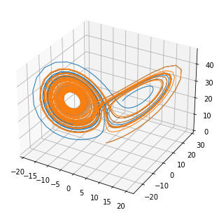

结果如图，说明这个方程的结果和初始值有很大的关系

> 其中odeint()函数用到的参数：
>
> lorenz：返回所要求解的方程组
>
> （0.0， 1.0， 0.0）：各个变量的初始值
>
> t：表示时间的数组，odeint()对此数组中的每个时间点进行求解，得出所有时间点的位置，
>
> args：直接传递给lorenz函数，应该就是prb的值，一直都是常量

各个方程之间互相无耦合的都可以直接用现成的scipy库求解


## 计算不定积分

```Python
from sympy import *  #引入包
x = symbols('x')      #声明变量'x'
a = Integral(cos(x)*exp(x),x)    # j
print(Eq(a,a.doit()))      
```

## Python实现累加

> 电机仿真时也可以用来近似计算积分

```Python
np.cumsum(x)
```

## ndarray数组中添加元素

> 不能直接append
>
> 应该：
>
> `np.append(ndarray, elements, axis)`  

```python
omega = np.append(omega, omega_1)
```


> 或者用insert：
>
> `np.insert(ndarray, index, elements, axis)`
>
> ```python
> Y = np.array([[1,2,3],[7,8,9]])
> w = np.insert(Y,1,[4,5,6],axis=0) # 向秩为2的ndarray第二行前，插入4,5,6
> v = np.insert(Y,1,5, axis=1) # 向秩为2的ndarray前第二列前，插入5
> ```
>
> - axis=0就是行
> - axis=1就是列、

## 设置绘图的dpi和大小

```python
plt.figure(figsize=(10, 20), dpi=100)
```


## 获取ndarray中某一个数的索引

```python
omega[np.where(T==t)]
```

> - 

## Python求解微分方程组

### 一、sympy.dsolve（解析解）
```python
import sympy as sy

def differential_equation(x,f):
    return sy.diff(f(x),x,2)+f(x)#f(x)''+f(x)=0 二阶常系数齐次微分方程
x=sy.symbols('x')#约定变量
f=sy.Function('f')#约定函数
print(sy.dsolve(differential_equation(x,f),f(x)))#打印
sy.pprint(sy.dsolve(differential_equation(x,f),f(x)))#漂亮的打印
```
输出：

```python
Eq(f(x), C1*sin(x) + C2*cos(x))
f(x) = C₁⋅sin(x) + C₂⋅cos(x)
```

### 二、scipy.integrate.odeint（数值解）

```python
import numpy as np
from scipy.integrate import odeint
#一阶微分方程的例子
def diff_equation(y,x):
    #dy/dx=y，其实手工解的话，很容易知道，y=Cexp(x)
    return np.array(y)#微分方程格式，左边一定是dy/dx,返回右边
x=np.linspace(0,1,num=100)#初始点是0
result=odeint(diff_equation,1,x)#中间那个是y0初值，即x=0时y=1
plt.plot(x,result[:,0])#result整个矩阵的第一列
plt.grid()#网格
plt.show()#这是y=exp(x)的图像
```

输出：图像


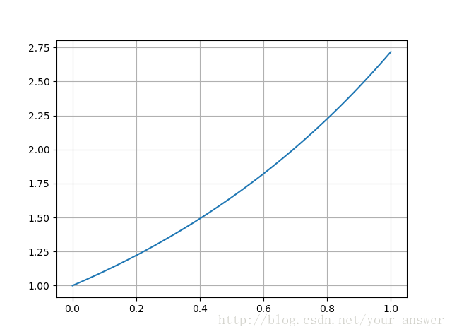

## Numpy 库


## ndarray数组的构造

### 1. 利用现有的数据（数组，列表，元组等）

### 2. 利用np.random模块（随机数）

<table>
<caption>
表1：np.random 模块常用函数</caption>
<tbody>
<tr>
<th>
函数</th>
<th>
描述</th>
</tr>
<tr>
<td>
np.random.random</td>
<td>
生成0到1之间的随机浮点数</td>
</tr>
<tr>
<td>
np.random.uniform</td>
<td>
从[0, 1)生成均匀分布的随机数</td>
</tr>
<tr>
<td>
np.random.randn</td>
<td>
生成标准正态的随机数</td>
</tr>
<tr>
<td>
np.random.randint</td>
<td>
根据由低到高的范围随机抽取整数</td>
</tr>
<tr>
<td>
np.random.normal</td>
<td>
生成正态分布</td>
</tr>
<tr>
<td>
np.random.shuffle</td>
<td>
随机打乱顺序</td>
</tr>
<tr>
<td>
np.random.seed</td>
<td>
设置随机数种子</td>
</tr>
<tr>
<td>
random_sample</td>
<td>
生成随机的浮点数</td>
</tr>
</tbody>
</table>
permutation(): 当参数为整数n时返回[0, n)这n个整数随机排列， 当参数为一个序列时返回随机排列后的序列，而shuffle是没有返回，直接将原序列打乱，

poisson(): 泊松分布可以指定$\lambda$的值

choice(): 随机抽取样本

下面来看一些函数的具体使用：

`np.random.randint(1, 100, size=10000)`

```python
import numpy as np

nd3 =np.random.random([4, 3])  #生成4行3列的数组
print(nd3)
print("nd3的形状为：",nd3.shape)
```

运行结果：

[[0.59115057 0.52022516 0.05992361]
 [0.5077815 0.81313999 0.70061259]
 [0.24654561 0.11705634 0.71399966]
 [0.73964407 0.57138345 0.89284498]]
nd3的形状为： (4, 3)

为了每次生成同一份数据，可以指定一个随机种子，使用 shuffle() 函数打乱生成的随机数。

```python
import numpy as np
np.random.seed(123)
nd4 = np.random.randn(4, 3)
print(nd4)
np.random.shuffle(nd4)
print("随机打乱后数据:")
print(nd4)
print(type(nd4))
```

运行结果：

[[-1.0856306  0.99734545 0.2829785 ]
 [-1.50629471 -0.57860025 1.65143654]
 [-2.42667924 -0.42891263 1.26593626]
 [-0.8667404 -0.67888615 -0.09470897]]
随机打乱后数据:
[[-1.50629471 -0.57860025 1.65143654]
 [-2.42667924 -0.42891263 1.26593626]
 [-0.8667404 -0.67888615 -0.09470897]
 [-1.0856306  0.99734545 0.2829785 ]]
<class 'numpy.ndarray'>

### 3. 创建特定形状的多维数组

<table>
<caption>
表2：NumPy 自带的数组创建函数</caption>
<tbody>
<tr>
<th>
函数</th>
<th>
描述</th>
</tr>
<tr>
<td>
np.zeros((3, 4))</td>
<td>
创建 3×4 的元素全为 0 的数组</td>
</tr>
<tr>
<td>
np.ones((3, 4))</td>
<td>
创建 3×4 的元素全为 1 的数组</td>
</tr>
<tr>
<td>
np.empty((2, 3))</td>
<td>
创建 2×3 的空数组，空数据中的值并不为 0，而是未初始化的垃圾值</td>
</tr>
<tr>
<td>
np.zeros_like(ndarr)</td>
<td>
以 ndarr 相同维度创建元素全为&nbsp; 0数组</td>
</tr>
<tr>
<td>
np.ones_like(ndarr)</td>
<td>
以 ndarr 相同维度创建元素全为 1 数组</td>
</tr>
<tr>
<td>
np.empty_like(ndarr)</td>
<td>
以 ndarr 相同维度创建空数组</td>
</tr>
<tr>
<td>
np.eye(5)</td>
<td>
该函数用于创建一个 5×5 的矩阵，对角线为 1，其余为 0</td>
</tr>
<tr>
<td>
np.full((3,5), 10)</td>
<td>
创建 3×5 的元素全为 10 的数组，10 为指定值</td>
</tr>
</tbody>
</table>

### 4. 生成对角矩阵

1. diag（可以指定对角元素）

   ```python
   np.diag([1] * 4)
   Out[1]: 
   array([[1, 0, 0, 0],
          [0, 1, 0, 0],
          [0, 0, 1, 0],
          [0, 0, 0, 1]])
   np.diag([2] * 4)
   Out[2]: 
   array([[2, 0, 0, 0],
          [0, 2, 0, 0],
          [0, 0, 2, 0],
          [0, 0, 0, 2]])
   ```

   > diag可以将一个方阵的对角（或非对角）元素作为一维数组返回或者将一维数组转换成一个方阵，并且非对角线上为0

## 常用numpy.linalg函数

   | 函数  | 描述                                                         |
   | :---: | :----------------------------------------------------------- |
   | diag  | 将一个方阵的对角（或非对角）元素作为一维数组返回或者将一维数组转换成一个方阵，并且非对角线上为0 |
   |  dot  | 矩阵点乘                                                     |
   | trace | 计算对角元素的和（矩阵的迹）                                 |
   |  det  | 计算矩阵的行列式                                             |
   |  eig  | 计算方阵的特征值和特征向量                                   |
   |  inv  | 计算方阵的逆矩阵                                             |
   | solve | 求解x的线性系统Ax = b，其中A是方阵                           |
   | lstsq | 计算Ax = b 的最小二乘解                                      |
   | pinv  | 求矩阵伪逆                                                   |
   | norm  | 求范数，默认是向量元素的平方和再开方                         |
   |       |                                                              |

   ## 数组的变形

   np.c_[a, b]: 构造分块矩阵[a, b]

   np.r_[a, b]: 构造分块矩阵[a; b]

### 数组的拼接和分裂

1. 向量和矩阵的连接

   np.concatenate([x, y, z])

   np.concatenate([x, y, z], axis=1)

   > 向量的话是连成一个向量，矩阵的话，默认是纵向连接，加上axis=1变成横向连接

2. 固定方向连接

   np.vstack([x, grid]): 垂直方向连接，

   np.vstack([x, grid]): 水平方向连接

3. 分裂

   np.split(arr, [3, 5]): 将一个数组分裂成arr[:3], arr[3: 5], arr[5:]

   ```python
   x = [1, 2, 3, 99, 99, 3, 2, 1]
   x1, x2, x3 = np.split(x, [3, 5])
   print(x1, x2, x3)
   ```

   np.hsplit(x, [2])和np.vsplit(x, [2]):就是将一个矩阵纵向或横向分裂成两个矩阵

   

   

   ## ndarry矩阵的运算

   ### 1. 矩阵按元素相乘

   方法：a*b或np.multiply(a,b) 尽量用multiply
   实例：
```python
   In [37]: a
   Out[37]: 
   array([[ 1,  0],
          [ 0, -1]])

   In [38]: b = np.array([[0,1],[1,0]])
   
   In [39]: b
   Out[39]: 
   array([[0, 1],
          [1, 0]])
   
   In [41]: a*b
   Out[41]: 
   array([[0, 0],
          [0, 0]])
   
   In [42]: np.multiply(a,b)
   Out[42]: 
   array([[0, 0],
          [0, 0]])
```

### 2. 矩阵乘法
方法：a@b 或者np.dot(a,b)
实例：

```python
In [43]: a = np.diag([1,-1])

In [44]: b = np.array([[0,1],[1,0]])

In [45]: a@b
Out[45]: 
array([[ 0,  1],
       [-1,  0]])

In [46]: np.dot(a,b)
Out[46]: 
array([[ 0,  1],
       [-1,  0]])
```
注意：np.dot(a,b)
使用说明：

- 当a和b都为2维数组(矩阵)时，进行矩阵乘法
- 当a和b都为1维数组时，进行内积运算，等价于np.sum(a*b)

### 3. 矩阵的指数运算
方法：scipy.linalg.expm(a)
实例：
```python
In [29]: a = np.array([[0,1],[1,0]])

In [30]: expm(-1j/2*np.pi*a)    #先导入, from scipy.linalg import expm
Out[30]: 
array([[0.+0.j, 0.-1.j],
       [0.-1.j, 0.+0.j]])
```
### 4. 矩阵的共轭、转置、共轭转置
a为2维数组(ndarray)

#### 共轭
方法：a.conj()或np.conj(a)

#### 转置
方法：a.T或a.transpose()

#### 共轭转置
未找到直接方法，可用a.conj().T或a.T.conj()

实例
```python
In [130]: x = np.array([[1+1j,1-1j],[1+1j,1-1j]])

In [131]: x
Out[131]: 
array([[1.+1.j, 1.-1.j],
       [1.+1.j, 1.-1.j]])

In [132]: x.T
Out[132]: 
array([[1.+1.j, 1.+1.j],
       [1.-1.j, 1.-1.j]])

In [133]: x.conj()
Out[133]: 
array([[1.-1.j, 1.+1.j],
       [1.-1.j, 1.+1.j]])

In [134]: x.T.conj()
Out[134]: 
array([[1.-1.j, 1.-1.j],
       [1.+1.j, 1.+1.j]])

In [135]: x.conj().T
Out[135]: 
array([[1.-1.j, 1.-1.j],
       [1.+1.j, 1.+1.j]])
```
### 5. 矩阵求逆
方法：np.linalg.inv(a)

实例：
```python
In [8]: a = np.array([[1,2],[3,4]])

In [9]: np.linalg.inv(a)
Out[9]:
array([[-2. ,  1. ],
       [ 1.5, -0.5]])

In [10]: np.linalg.inv(a)@a
Out[10]:
array([[1.0000000e+00, 4.4408921e-16],
       [0.0000000e+00, 1.0000000e+00]])
```
### 6. 矩阵的本征值
方法: w,v = np.linalg.eig(a)

注意：

w为本征值array，它是无序的
v为矩阵，每一列表示一个归一化的本征向量，v[:,i]对应w[i]
实例:
```python
In [17]: a = np.array([[1,0],[0,-1]])

In [18]: w,v=np.linalg.eig(a)

In [19]: w
Out[19]: array([ 1., -1.])

In [20]: v
Out[20]: 
array([[1., 0.],
       [0., 1.]])
```
### 7. 矩阵的迹(trace)
方法: a.trace()或np.trace(a),等价于np.sum(np.diag(a))

实例:
```python
In [26]: a = np.arange(1,5).reshape((2,2))

In [27]: a
Out[27]: 
array([[1, 2],
       [3, 4]])

In [28]: a.trace()
Out[28]: 5

In [29]: np.trace(a)
Out[29]: 5
```
### 8. 矩阵的张量积
方法: np.kron(a,b)

实例:
```python
In [21]: a = np.array([[1,0],[0,0]])

In [22]: b = np.array([[0,0],[0,1]])

In [23]: np.kron(a,b)
Out[23]: 
array([[0, 0, 0, 0],
       [0, 1, 0, 0],
       [0, 0, 0, 0],
       [0, 0, 0, 0]])

```

### 9. 求矩阵中的最大最小值

不管矩阵是几维的都可以求出真个矩阵的最大最小值

`a.max()`

`a.min()`

## 产生随机数

使用np.random库

| 函数名  | 功能             |
| ------- | ---------------- |
| rand    | 0到1之间的随机数 |
| randint |                  |

## 其他numpy函数

#### (1). np.set_printoptions(): 设置小数的显示精度


`np.set_printoptions(precision=None, threshold=None,  linewidth=None, suppress=None, formatter=None)`

> 1. precision: 控制输出结构的精度，默认为8
> 2. threshold: 当元组元素总数过大时显示的数字位数
> 3. linewidth: 每行字符的数目其余的换到下一行
> 4. suppress: 小数是否以科学计数法形式输出
> 5. formatter：自定义输出规则

例如：

`np.set_printoptions(precision=2)`:显示小数点后两位

```python
import numpy as np
np.set_printoptions(precision=4)
np.array([1.314142143412])

out: array([1.3141])
```

#### （2）查找数组中最大值和最小值

1. `np.argmax()`同理`np.argmin()`

2. `np.where(a=max(a))`同理`np.where(a=min(a))`


## Python 基本数据类型及操作

### 1. 数字类型

1. divmod(a, b) 函数把除数和余数运算结果结合起来，返回一个包含商和余数的元组(a // b, a % b)。

2. abs() 函数返回数字的绝对值。

3. pow() 方法返回 xy（x的y次方）的值。

4. round（x,n）返回浮点数x四舍五入后保留n位小数的值

5. nim(),max()会返回给定序列的最小/最大值

### 2. 字符串类型

#### 以下为需掌握的函数：（难度：⭐⭐）

chr() 用一个范围在 range（256）内的（就是0～255）整数作参数，返回一个对应的字符。

ord() 函数是 chr() 函数（对于8位的ASCII字符串）的配对函数，它以一个字符（长度为1的字符串）作为参数，返回对应的 ASCII 数值。

oct() 函数将一个整数转换成8进制字符串。

hex() 函数用于将10进制整数转换成16进制，以字符串形式表示。

len() 方法返回对象（字符、列表、元组等）长度或项目个数。

str()返回一个对象的string格式。

#### str也内置了很多对字符串进行操作的函数：

> string.upper()转换string 中的小写字母为大写
>
> string.lower()转换string 中的小写字母为小写
>
> string.capitalize()把字符串的第一个字符大写
>
> string.find(str,beg=0, end=len(string)) 检测 str 是否包含在 string 中，如果 beg 和end 指定范围，则检查是否包含在指定范围内，如果是返回 开始的索引值，否则返回-1
>
> string.join(seq)以 string 作为分隔符，将 seq 中所有的元素(的字符串表示)合并为一个新的字符串
>
> string.rfind(str,beg=0,end=len(string) ) 类似于 find()函数，不过是从右边开始查找.
>
> ==string.split() 用空格对字符串进行分割，string.split(', '): 用逗号分隔==
>
> str.center(width, fillchar): 返回长度为width的字符串，其中str位于新字符串中心位置，两侧新增字符采用fillchar填充
>
> ==str.strip(): 去除字符串首尾的空格==

### 3. 列表类型（list）

> list.append(obj)在列表末尾添加新的对象
>
> list.extend(seq)在列表末尾一次性追加另一个序列中的多个值（用新列表扩展原来的列表）
>
> list.insert(index,obj)将对象插入列表
>
> list.pop([index=-1])移除列表中的一个元素（默认最后一个元素），并且返回该元素的值
>
> list.remove(obj)移除列表中某个值的第一个匹配项
>
> list.reverse()反向列表中元素
>
> ==list.sort(cmp=None,key=None, reverse=False)对原列表进行排序==
>
> list.count(obj)统计某个元素在列表中出现的次数
>
> list.replace(a, b) 将列表中的啊替换成b

### 4. 元组类型（tuple）

元组和列表差不多就是不能修改

### 5. 字典类型（dictionary）

> dict.clear()删除字典内所有元素
> dict.copy()返回一个字典的浅复制
> dict.fromkeys(seq[, val])创建一个新字典，以序列 seq 中元素做字典的键，val 为字典所有键对应的初始值
> dict.get(key,default=None)返回指定键的值，如果值不在字典中返回default值
> ==dict.has_key(key)如果键在字典dict里返回true，否则返回false==
> **dict.items()以列表返回可遍历的(键, 值) 元组数组**
> ==dict.keys()以列表返回一个字典所有的键==
>
> > dict.keys()可以当作列表操作，但实际上是dict_keys数据类型而不是list
>
> dict.update(dict2)把字典dict2的键/值对更新到dict里
> dict.values()以列表返回字典中的所有值
> pop(key[,default])删除字典给定键 key 所对应的值，返回值为被删除的值。key值必须给出。否则，返回default值。
> popitem()返回并删除字典中的最后一对键和值。

- ==根据字典的键进行排序并输出前十个：==

```python
ls = list(d.items())
ls.sort(key=lambda x: x[1], reverse=True)  # 从大到小排序
for k in range(10):
    print(ls[k][0], end='')
```


### 6. 集合（set）（难度：⭐⭐）

集合（set）是一个无序的不重复元素序列，可以使用大括号{}或者set()函数创建集合，注意：创建一个空集合必须用 set() 而不是{}，因为{}是用来创建一个空字典。下面是集合的一些操作;

> add(x)元素x添加到集合s中，如果元素已存在，则不进行任何操作。
> remove(x)将元素x从集合s中移除，如果元素不存在，则会发生错误。
> len() 计算集合s元素个数。
> clear() 清空集合s。
> pop()随机移除元素
> symmetric_difference()返回两个集合中不重复的元素集合
> union()返回两个集合的并集
> symmetric_difference_update()移除当前集合中在另外一个指定集合相同的元素，并将另外一个指定集合中不同的元素插入到当前集合中。
> difference()返回多个集合的差集

#### 向集合中添加元素

1. 使用add()

   > 将需要添加的元素当成一个整体添加到集合中

2. 使用update()

   > 将传入的元素拆分，作为个体传入到集合中


## Turtle库使用

用来绘图

- 绘制状态函数：pendown()、penup()、pensize()以及对应别名为pd()、pu()、width()；
- 颜色控制函数：color()、pencolor()、begin_fill()、end_fill()；
- 运动控制函数：forward()、backward()、right()、left()、setheading()、goto()、circle()以及对应别名fd、bk()、rt()、lt()、seth()


## Turtle库介绍

### Turtle绘图步骤：

#### 1. 画布（canvas）设置

 画布就是turtle为我们展开用于绘图区域，我们可以设置它的大小和初始位置。

##### 设置画布大小

​     turtle.screensize(canvwidth=None, canvheight=None, bg=None)，参数分别为画布的宽(单位像素), 高, 背景颜色。

如：

```python
turtle.screensize(800,600, "green")
turtle.screensize() #返回默认大小(400, 300)
```

##### 设置画布大小及初始位置 

turtle.setup(width=0.5, height=0.75, startx=None, starty=None)，参数：width, height: 输入宽和高为整数时, 表示像素; 为小数时, 表示占据电脑屏幕的比例，(startx, starty): 这一坐标表示矩形窗口左上角顶点的位置, 如果为空,则窗口位于屏幕中心。

如：

    turtle.setup(width=0.6,height=0.6)
    turtle.setup(width=800,height=800, startx=100, starty=100)

#### 2. 画笔设置

包括颜色宽度等

1. turtle.pensize(): 设置画笔宽度
2. turtle.pencolor(): 没有参数传入，返回当前画笔颜色，传入参数设置画笔颜色，可以是字符串如"green", "red",也可以是RGB 3元组。
3. turtle.speed(speed): 设置画笔移动速度，画笔绘制的速度范围[0,10]整数，数字越大越快。

#### 3. 绘图命令

操纵海龟绘图有着许多的命令，这些命令可以划分为3种：一种为运动命令，一种为画笔控制命令，还有一种是全局控制命令。

<center>1. 画笔运动命令


<div align="center"> 
 <div class="table-box"><table border="1" cellspacing="0" cellpadding="0"><tbody><tr><td> <p align="center"><span style="font-size:14px">命令</span></p> </td><td> <p align="center"><span style="font-size:14px">说明</span></p> </td></tr><tr><td> <p align="center"><span style="font-size:14px">turtle.forward(distance)</span></p> </td><td> <p align="center"><span style="font-size:14px">向当前画笔方向移动distance像素长度</span></p> </td></tr><tr><td> <p align="center"><span style="font-size:14px">turtle.backward(distance)</span></p> </td><td> <p align="center"><span style="font-size:14px">向当前画笔相反方向移动distance像素长度</span></p> </td></tr><tr><td> <p align="center"><span style="font-size:14px">turtle.right(degree)</span></p> </td><td> <p align="center"><span style="font-size:14px">顺时针移动degree°</span></p> </td></tr><tr><td> <p align="center"><span style="font-size:14px">turtle.left(degree)</span></p> </td><td> <p align="center"><span style="font-size:14px">逆时针移动degree°</span></p> </td></tr><tr><td> <p align="center"><span style="font-size:14px">turtle.pendown()</span></p> </td><td> <p align="center"><span style="font-size:14px">移动时绘制图形，缺省时也为绘制</span></p> </td></tr><tr><td> <p align="center"><span style="font-size:14px">turtle.goto(x,y)</span></p> </td><td> <p align="center"><span style="font-size:14px">将画笔移动到坐标为x,y的位置</span></p> </td></tr><tr><td> <p align="center"><span style="font-size:14px">turtle.penup()</span></p> </td><td> <p align="center"><span style="font-size:14px">提起笔移动，不绘制图形，用于另起一个地方绘制</span></p> </td></tr><tr><td> <p align="center"><span style="font-size:14px">turtle.circle()</span></p> </td><td> <p align="center"><span style="font-size:14px">画圆，半径为正(负)，表示圆心在画笔的左边(右边)画圆</span></p> </td></tr><tr><td> <p align="center"><span style="font-size:14px">setx( )</span></p> </td><td> <p align="center"><span style="font-size:14px">将当前x轴移动到指定位置</span></p> </td></tr><tr><td> <p align="center"><span style="font-size:14px">sety( )</span></p> </td><td> <p align="center"><span style="font-size:14px">将当前y轴移动到指定位置</span></p> </td></tr><tr><td> <p align="center"><span style="font-size:14px">setheading(angle)</span></p> </td><td> <p align="center"><span style="font-size:14px">设置当前朝向为angle角度</span></p> </td></tr><tr><td> <p align="center"><span style="font-size:14px">home()</span></p> </td><td> <p align="center"><span style="font-size:14px">设置当前画笔位置为原点，朝向东。</span></p> </td></tr><tr><td> <p align="center"><span style="font-size:14px">dot(r)</span></p> </td><td> <p align="center"><span style="font-size:14px">绘制一个指定直径和颜色的圆点</span></p> </td></tr></tbody></table></div> 
</div>


<center>2. 画笔控制命令


<div align="center"> 
 <div class="table-box"><table border="1" cellspacing="0" cellpadding="0"><tbody><tr><td> <p align="center"><span style="font-size:14px">命令</span></p> </td><td> <p align="center"><span style="font-size:14px">说明</span></p> </td></tr><tr><td> <p align="center"><span style="font-size:14px">turtle.fillcolor(colorstring)</span></p> </td><td> <p align="center"><span style="font-size:14px">绘制图形的填充颜色</span></p> </td></tr><tr><td> <p align="center"><span style="font-size:14px">turtle.color(color1, color2)</span></p> </td><td> <p align="center"><span style="font-size:14px">同时设置pencolor=color1, fillcolor=color2</span></p> </td></tr><tr><td> <p align="center"><span style="font-size:14px">turtle.filling()</span></p> </td><td> <p align="center"><span style="font-size:14px">返回当前是否在填充状态</span></p> </td></tr><tr><td> <p align="center"><span style="font-size:14px">turtle.begin_fill()</span></p> </td><td> <p align="center"><span style="font-size:14px">准备开始填充图形</span></p> </td></tr><tr><td> <p align="center"><span style="font-size:14px">turtle.end_fill()</span></p> </td><td> <p align="center"><span style="font-size:14px">填充完成</span></p> </td></tr><tr><td> <p align="center"><span style="font-size:14px">turtle.hideturtle()</span></p> </td><td> <p align="center"><span style="font-size:14px">隐藏画笔的turtle形状</span></p> </td></tr><tr><td> <p align="center"><span style="font-size:14px">turtle.showturtle()</span></p> </td><td> <p align="center"><span style="font-size:14px">显示画笔的turtle形状</span></p> </td></tr></tbody></table></div> 
</div>


<center>3. 全局控制命令


<div align="center"> 
 <div class="table-box"><table border="1" cellspacing="0" cellpadding="0"><tbody><tr><td> <p align="center"><span style="font-size:14px">命令</span></p> </td><td> <p align="center"><span style="font-size:14px">说明</span></p> </td></tr><tr><td> <p align="center"><span style="font-size:14px">turtle.clear()</span></p> </td><td> <p align="center"><span style="font-size:14px">清空turtle窗口，但是turtle的位置和状态不会改变</span></p> </td></tr><tr><td> <p align="center"><span style="font-size:14px">turtle.reset()</span></p> </td><td> <p align="center"><span style="font-size:14px">清空窗口，重置turtle状态为起始状态</span></p> </td></tr><tr><td> <p align="center"><span style="font-size:14px">turtle.undo()</span></p> </td><td> <p align="center"><span style="font-size:14px">撤销上一个turtle动作</span></p> </td></tr><tr><td> <p align="center"><span style="font-size:14px">turtle.isvisible()</span></p> </td><td> <p align="center"><span style="font-size:14px">返回当前turtle是否可见</span></p> </td></tr><tr><td> <p align="center"><span style="font-size:14px">stamp()</span></p> </td><td> <p align="center"><span style="font-size:14px">复制当前图形</span></p> </td></tr><tr><td> <p align="center"><span style="font-size:14px">turtle.write(s [,font=("font-name",font_size,"font_type")])</span></p> </td><td> <p align="center"><span style="font-size:14px">写文本，s为文本内容，font是字体的参数，分别为字体名称，大小和类型；font为可选项，font参数也是可选项</span></p> </td></tr></tbody></table></div> 
</div>


<center>4. 其他命令<\center>


<div align="center"> 
 <div class="table-box"><table border="1" cellspacing="0" cellpadding="0"><tbody><tr><td> <p align="center"><span style="font-size:14px">命令</span></p> </td><td> <p align="center"><span style="font-size:14px">说明</span></p> </td></tr><tr><td> <p align="center"><span style="font-size:14px">turtle.mainloop()或turtle.done()</span></p> </td><td> <p align="center"><span style="font-size:14px"><span style="color:rgb(34,34,34)">启动事件循环</span><span style="color:rgb(34,34,34)"> -</span><span style="color:rgb(34,34,34)">调用</span><span style="color:rgb(34,34,34)">Tkinter</span><span style="color:rgb(34,34,34)">的</span><span style="color:rgb(34,34,34)">mainloop</span><span style="color:rgb(34,34,34)">函数。</span></span></p> <p align="center"><span style="color:rgb(34,34,34)"><span style="font-size:14px">必须是乌龟图形程序中的最后一个语句。</span></span></p> </td></tr><tr><td> <p align="center"><span style="font-size:14px">turtle.mode(mode=None)</span></p> </td><td> <p align="center"><span style="font-size:14px"><span style="color:rgb(34,34,34)">设置乌龟模式（</span><span style="color:rgb(34,34,34)">“standard”</span><span style="color:rgb(34,34,34)">，</span><span style="color:rgb(34,34,34)">“logo”</span><span style="color:rgb(34,34,34)">或</span><span style="color:rgb(34,34,34)">“world”</span><span style="color:rgb(34,34,34)">）并执行重置。如果没有给出模式，则返回当前模式。</span></span></p> 
     <div align="center"> 
      <div class="table-box"><table border="1" cellspacing="0" cellpadding="0"><tbody><tr><td> <p align="center"><span style="color:#222222"><span style="font-size:14px">模式</span></span></p> </td><td> <p align="center"><span style="color:#222222"><span style="font-size:14px">初始龟标题</span></span></p> </td><td> <p align="center"><span style="color:#222222"><span style="font-size:14px">正角度</span></span></p> </td></tr><tr><td> <p align="center"><span style="color:rgb(34,34,34)"><span style="font-size:14px">standard</span></span></p> </td><td> <p align="center"><span style="color:#222222"><span style="font-size:14px">向右（东）</span></span></p> </td><td> <p align="center"><span style="color:#222222"><span style="font-size:14px">逆时针</span></span></p> </td></tr><tr><td> <p align="center"><span style="color:rgb(34,34,34)"><span style="font-size:14px">logo</span></span></p> </td><td> <p align="center"><span style="color:#222222"><span style="font-size:14px">向上（北）</span></span></p> </td><td> <p align="center"><span style="color:#222222"><span style="font-size:14px">顺时针</span></span></p> </td></tr></tbody></table></div> 
     </div> </td></tr><tr><td> <p align="center"><span style="font-size:14px">turtle.delay(delay=None)</span></p> </td><td> <p align="center"><span style="color:rgb(34,34,34)"><span style="font-size:14px">设置或返回以毫秒为单位的绘图延迟。</span></span></p> </td></tr><tr><td> <p align="center"><span style="font-size:14px">turtle.begin_poly()</span></p> </td><td> <p align="center"><span style="color:rgb(34,34,34)"><span style="font-size:14px">开始记录多边形的顶点。当前的乌龟位置是多边形的第一个顶点。</span></span></p> </td></tr><tr><td> <p align="center"><span style="font-size:14px">turtle.end_poly()</span></p> </td><td> <p align="center"><span style="color:rgb(34,34,34)"><span style="font-size:14px">停止记录多边形的顶点。当前的乌龟位置是多边形的最后一个顶点。将与第一个顶点相连。</span></span></p> </td></tr><tr><td> <p align="center"><span style="font-size:14px">turtle.get_poly()</span></p> </td><td> <p align="center"><span style="color:rgb(34,34,34)"><span style="font-size:14px">返回最后记录的多边形。</span></span></p> </td></tr></tbody></table></div> 
</div>


## 文件的打开、关闭和读写

  open() 方法用于打开一个文件，并返回文件对象，在对文件进行处理过程都需要使用到这个函数，如果该文件无法被打开，会抛出OSError。完整的语法格式为：
  open(file,mode='r', buffering=-1, encoding=None, errors=None, newline=None, closefd=True, opener=None）

  > 文件打开模式：
  > x写模式，新建一个文件，如果该文件已存在则会报错
  > b二进制模式
  > a打开一个文件用于追加。如果该文件已存在，文件指针将会放在文件的结尾。也就是说，新的内容将会被写入到已有内容之后。如果该文件不存在，创建新文件进行写入。
  > r以只读方式打开文件。文件的指针将会放在文件的开头。这是默认模式
  > r+打开一个文件用于读写。文件指针将会放在文件的开头。
  > w打开一个文件只用于写入。如果该文件已存在则打开文件，并从开头开始编辑，即原有内容会被删除。如果该文件不存在，创建新文件。
  > +打开一个文件进行更新(可读可写)。
  > 互不冲突的打开模式可以可以进行叠加，比如ab表示以二进制格式打开一个文件用于追加。如果该文件已存在，文件指针将会放在文件的结尾。也就是说，新的内容将会被写入到已有内容之后。如果该文件不存在，创建新文件进行写入。
  > file.close() 关闭文件。关闭后文件不能再进行读写操作
  >
  > 也可以用类似with open file as f:来打开文件


## Python绘图技巧

[Examples — Matplotlib 3.5.1 documentation](https://matplotlib.org/stable/gallery/index.html 'matplotlib官网')

[超全！整理了65个Matplotlib可视化案例！ (qq.com)](https://mp.weixin.qq.com/s/heQ0Pe5Y-qF3hfrJKlOW4Q)

### 1.基本设置

```Python
import numpy as np
import pandas as pd
import matplotlib as mpl
import matplotlib.pyplot as plt
import seaborn as sns
import warnings

warnings.filterwarnings(action='once')

large = 22
med = 16
small = 12
params = {'axes.titlesize': large,
          'legend.fontsize': med,
          'figure.figsize': (16, 10),
          'axes.labelsize': med,
          'axes.titlesize': med,
          'xtick.labelsize': med,
          'ytick.labelsize': med,
          'figure.titlesize': large}
plt.rcParams.update(params)
plt.style.use('seaborn-whitegrid')
sns.set_style("white")
%matplotlib inline
```

### 2.创建子图

```Python
fig = plt.figure()
ax1 = fig.add_subplot(121)
ax2 = fig.add_subplot(122)
```

### 3.绘制3D图

```Python
from mpl_toolkits.mplot3d import Axes3D
import matplotlib.pyplot as plt

fig = plt.figure()
ax = fig.add_subplot(111, projection='3d')
```

### 4.显示背景网络

```Python
plt.grid(True, linewidth=0.5, color='r', linestyle='-'
```

### 5.以高dpi绘制PDF输出

```Python
plt.savefig('output.pdf', dpi=1200, format='pdf', bbox_inches='tight')
```

### 6. matplotlib支持中文

1. ```python
   mpl.rcParams['font.family'] = 'SimHei'
   plt.rcParams['axes.unicode_minus'] = False   # 步骤二（解决坐标轴负数的负号显示问题）
   ```

2. ```python
   font = {'family' : 'SimHei',
           'weight' : 'bold',
           'size'   : '16'}
   plt.rc('font', **font)               # 步骤一（设置字体的更多属性）
   plt.rc('axes', unicode_minus=False)  # 步骤二（解决坐标轴负数的负号显示问题）
   ```

   这两种方法都是全局设置

> 其他常用字体：
>
> - 宋体：SimSun
> - 黑体：SimHei
> - 微软雅黑：Microsoft YaHei


### 7. 旋转x轴或y轴刻度标签（ticks）

#### 1. plt.xticks()

```python
plt.xticks(rotation=90) # 旋转90度
```

#### 2. ax.set_xticklabels()

```pthon
ax.set_xticklabels(labels=x, rotation=90)  *# 旋转90度*
```

#### 3. tick.set_rotation(90)可以旋转一部分

```python
for tick in ax.get_xticklabels():
    tick.set_rotation(90)  # 这个可以旋转一部分
```

#### 4. 综合

```python
my_label = ['I am No.3','I am No.4','I am No.999'] 
plt.xticks(ticks=[3,14,999],labels=my_label,
    rotation=60, ha='right')   
```


### 8. 旋转y轴标题（ylabel）

```python
plt.ylabel(rotation=0)
```

> 因为默认的rotation=90 ，改为0即可

### 9. matplotlib设置网格

```python
plt.grid(b, which, axis, color, linestyle, linewidth)
```

> 参数设置：
>
> b : 布尔值。就是是否显示网格线的意思。官网说如果b设置为None， 且kwargs长度为0，则切换网格状态。但是没弄明白什            么意思。如果b设置为None，但是又给了其它参数，则默认None值失效。
>
>  which : 取值为'major', 'minor'， 'both'。 默认为'major'。看别人说是显示的，我的是Windows7下，用Sublime跑的，minor只是一个白画板，没有网格，major和both也没看出什么效果，不知道为什么。
>
>  axis : 取值为‘both’， ‘x’，‘y’。就是以什么轴为刻度生成网格。例如我输入参数x就会在x轴方向上生成纵向的网格刻度。没有输入的方向则不会显示网格刻度。
>
>  color : 这就不用多说了，就是设置网格线的颜色。或者直接用c来代替color也可以。
>
>  linestyle :也可以用ls来代替linestyle， 设置网格线的风格，是连续实线，虚线或者其它不同的线条。 | '-' | '--'| '-.' | ':' | 'None' | ' ' | '']
>
>  linewidth : 设置网格线的宽度

### 10. 直接根据函数绘图

使用ax.imshow()或者plt.imshow(),里面还可以用cmap = plt.cm.gray等设置颜色

```python
import matplotlib.pyplot as plt 
import numpy as np

points = np.arange(-5,5,0.01)

xs,ys = np.meshgrid(points,points)

z = np.sqrt(xs**2 + ys**2)

#创建新的figure
fig = plt.figure()

#绘制2x2两行两列共四个图，编号从1开始
ax = fig.add_subplot(221)
ax.imshow(z)

ax = fig.add_subplot(222)
#使用自定义的colormap(灰度图)
ax.imshow(z,cmap=plt.cm.gray)

ax = fig.add_subplot(223)
#使用自定义的colormap
ax.imshow(z,cmap=plt.cm.cool)

ax = fig.add_subplot(224)
#使用自定义的colormap
ax.imshow(z,cmap=plt.cm.hot)

#图片的显示
plt.show()
```

### 11. 给特定位置上色

#### 一. 生成测试数据

```python
import munpy as np
import matplotlib.pyplot as plt

x = np.array([i for i in range(30)])
y = np.random.rand(30)

plt.plot(x, y)
plt.show()
```

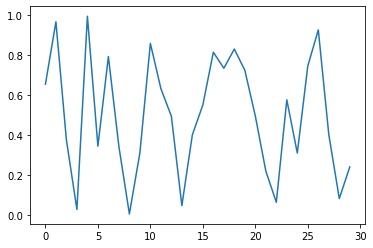

#### 二. 曲线覆盖

将曲线下面部分全部覆盖为绿色调用函数`plt.fill_between()`即可实现

```python
plt.plot(x, y)  # 要先将图画出来
plt.fill_between(x, 0, y, facecolor='green', alpha=0.3)
```

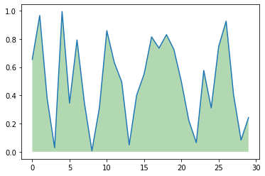

函数的几个参数：
`x`：第一个参数表示覆盖的区域，我直接设置为x，表示整个x都覆盖
`0`：表示覆盖的下限
`y`：表示覆盖的上限是y这个曲线
`facecolor`：覆盖区域的颜色
`alpha`：覆盖区域的透明度[0,1],其值越大，表示越不透明


#### 三. 部分区域覆盖

```python
plt.plot(x, y)
plt.fill_between(x[2: 15], 0.2, 0.6, facecolor='green', alpha=0.3)
plt.show()
```

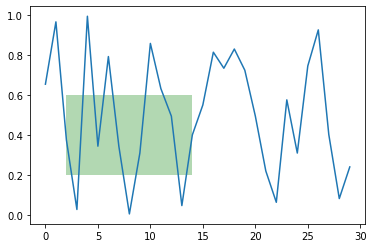

#### 四. 两曲线之间的部分填充

```python
y1 = np.random.rand(30)  # 生成第一条曲线
y2 = y1 + 0.3  # 生成第二条曲线
plt.plot(x, y1, 'b')
plt.plot(x, y2, 'r')
plt.fill_between(x, y1, y2, facecolor='green', alpha=0.3)
plt.show()
```

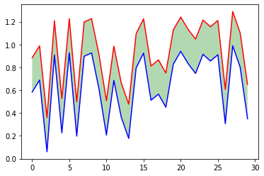

#### 五. 实现数据高亮

```python
x = np.array([i for i in range(30)])
y = np.random.rand(30)

# 设置想要高亮数据的位置
position = [[1, 6],
            [10, 12],
            [20, 23],
            [26, 28]]

# 画图
plt.plot(x, y, 'r')
for i in position:
    plt.fill_between(x[ i[0] : i[1] ], 0, 1, facecolor='green', alpha=0.3)
plt.show()
```

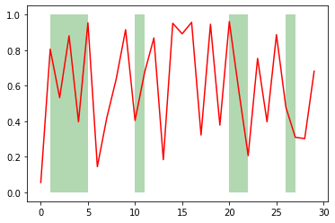

#### 六. 已知多边形顶点坐标（使用plt.fill）

```python
import matplotlib.pyplot as plt
x = [0, 0, 5, 10, 15, 15, 10, 5]
y = [5, 10, 15, 15, 10, 5, 0, 0]
plt.fill(x, y, color='cornflowerblue')
plt.show()
```

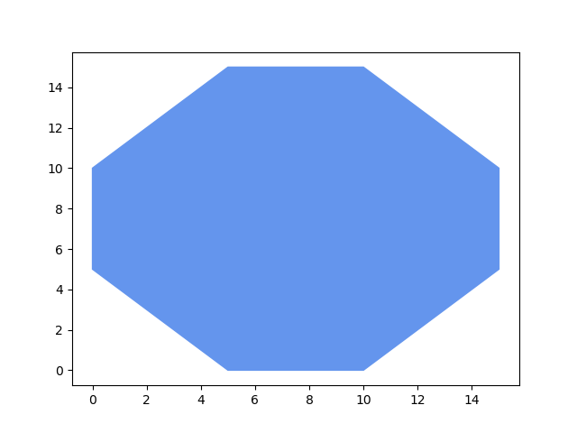

### 12. 自动调节子图的大小

在最后plt.show()之前加上一句`plt.tight_layout()`

> 可以使子图自动充满整个区域，同时防止标签之间重叠


### 13. 面向对象

```python
# 什么是Artist对象
# 1.简单的Artist对象是标准的绘图元件，例如Line2D，Rectangle，Text，AxesImage等
# 2.容器类型包含多个Artist对象使他们组织成一个整体例如Axis，Axes，Figure对象
# 利用Artist对象进行绘图的流程分为如下三步
# 1.创建Figure对象
# 2.为Figure对象创建一个或多个Axes对象
# 3.调用Axes对象的方法来创建各种简单的Artist对象
# Artist对象有许多属性控制其显示效果，例如Figure，Axes对象都有patch属性作为背景
# figure()创建Figure对象的时候会进行许多的初始化操作
fig = plt.figure()
# 列表用于描述图片所在的位置以及图片的大小
ax = fig.add_axes([0.15, 0.1, 0.7, 0.3])
ax.set_xlabel('time')
line = ax.plot([1, 2, 3], [1, 2, 1])[0]
# ax的lines属性是一个包含所有曲线的列表
print(line is ax.lines[0])
# 通过get_*获得相应的属性
print(ax.get_xaxis().get_label().get_text())
plt.show()
```

#### 1. 面向对象绘图基本流程

1. 创建Figure对象

   > `fig = plt.figure()`

2. 为Figure对象创建一个或多个Axes对象

   > `ax = fig.add_axes([0.15, 0.1, 0.7, 0.3])`

3. 调用Axes对象的方法来创建各种简单类型的Artist对象， axes，fig，line等都是Artist对象

   > Artist对象就是标准的绘图元件
   
   >  `line = ax.plot([1, 2, 3], [1, 2, 1])[0]  # 返回的是只有一个元素的列表`


#### 2. 通过`set_*`设置

如`ax.set_xlabel('time')`

设置图片和轴的背景：`fig.patch.set_color('g')  # 设置背景为绿色`

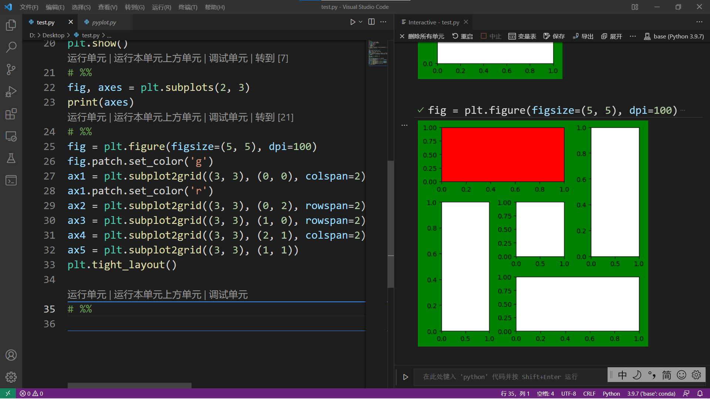

#### 3. Artist对象的属性

| 属性      | 说明                           |
| :-------- | :----------------------------- |
| alpha     | 透明的，0到1之间               |
| animated  | 布尔值，在绘制动画效果是使用   |
| clip_box  | 对象的裁剪框                   |
| clip_on   | 是否裁剪                       |
| clip_path | 裁剪的路径                     |
| contains  | 判断指定点是否在对象之上的函数 |
| label     | 文本标签                       |
| picker    | 控制Artist对象的 选取          |
| transform | 控制偏移，旋转，缩放等坐标变换 |
| visible   | 控制是否可见                   |
| zorder    | 控制绘图顺序                   |


## Pandas导入数据

常用数据文件格式有文本文件（txt）Excel文件（.xls, .xlsx）和csv文件（.csv）

### 1. 使用read_excel()读取Excle文件

`pd.read_excel(io, sheetname=0, header=0, index_col=None, names=None)`

#### pd.read_excel()的主要参数：

> io：文件路径（包括文件名）
>
> header：指定作为列名的行， 默认为0，即首行为标题行，设置header=None，表示无标题行，首行就是数据行
>
> sheetname：指定工作表，默认为0，设置sheetname=None返回全表，设置sheetname=[0, 1]返回多个表
>
> index_col：指定作为行索引的列序号或列名
>
> names：指定列名，类型为list

#### 使用实例：

```python
# sheetname表示读取指定的工作表，header=0表示首行为标题行， header=None表示首行为数据行
df = pd.read_excel('data/youcans1.xls', sheetname='Sheet1', header=0)
```

### 使用read_csv()读取csv文件

`pd.read_csv( filepath ,sep=',', header='infer', names=None, index_col=None)`

#### pd.read_csv()的主要参数：

> filepath ： 文件路径（包括文件名）。 
>
> sep：指定分隔符。默认为逗号 ','，可根据需要设置其它分隔符。
>
> header ：指定作为列名的行。如果文件没有列名则默认为 0，表示首行就是数据行；设置 header=None，表示无标题行，首行就是数据行。
>
> ndex_col ：指定作为行索引的列编号或列名。 
>
> names：指定列名， 类型为 list。

#### 使用实例：

```python
# sep=','表示间隔符为逗号，header=0表示首行为标题行，header=None 表示首行为数据行
df = pd.read_csv("data/youcans2.csv", header=0, sep=',') 
```


### 3. 读取文本文件

**对于文本文件 .txt 和 .dat，可以使用 pandas.read_table() 函数读取 。**

`pd.read_table( filepath ,sep='\t', header='infer', names=None, index_col=None)`

#### pd.read_table()的主要参数：

> filepath ： 文件路径（包括文件名）。
>
> sep：指定分隔符。默认为 tab 制表符，可根据需要设置其它分隔符
>
> header ：指定作为列名的行。如果文件没有列名则默认为 0，表示首行就是数据行；设置 header=None，表示无标题行，首行就是数据行。
>
> index_col ：指定作为行索引的列编号或列名。 names：指定列名， 类型为 list。

#### 使用实例：

```python
# sep='\t'表示分隔符为制表符，header=None 表示无标题行，第一行是数据
df = pd.read_table("data/youcans3.dat", sep="\t", header=None)
```

### 4. 读取其他类型

Pandas 还提供了读取多种文件格式的函数，使用方法也都类似，都是一行代码搞定。例如：

- pandas.read_sql，读取 SQL 数据库
- pandas.read_html，抓取网页中的表格数据
- pandas.read_json，读取 JSON 数据文件
- pandas.read_clipboard，读取剪贴板内容


## 正则表达式

正则表达式(regular expression)描述了一种字符串匹配的模式（pattern），可以用来检查一个串是否含有某种子串、将匹配的子串替换或者从某个串中取出符合某个条件的子串等。

参考：[正则表达式 – 语法 | 菜鸟教程 (runoob.com)](https://www.runoob.com/regexp/regexp-syntax.html)

### 1. 单个字符

用来匹配单个字符

| 字符       | 描述                                                         |
| :--------- | :----------------------------------------------------------- |
| **[ABC]**  | 匹配 **[...]** 中的所有字符，例如 **[aeiou]** 匹配字符串 "google runoob taobao" 中所有的 e o u a 字母。 |
| **[^ABC]** | 匹配除了 **[...]** 中字符的所有字符，例如 **[^aeiou]** 匹配字符串 "google runoob taobao" 中除了 e o u a 字母的所有字母。 |
| **[A-Z]**  | [A-Z] 表示一个区间，匹配所有大写字母，[a-z] 表示所有小写字母。 |
| **.**      | 匹配除换行符（\n、\r）之外的任何单个字符，相等于 [^\n\r]。   |
| **[\s\S]** | 匹配所有。\s 是匹配所有空白符，包括换行，\S 非空白符，不包括换行。 |
| **\w**     | 匹配字母、数字、下划线。等价于 [A-Za-z0-9_]                  |


### 2. 特殊字符

查找特殊字符时需要转义

| 特殊字符 | 描述                                                         |
| -------- | ------------------------------------------------------------ |
| $        | 匹配输入字符的结尾位置                                       |
| ()       | 标记一个子表达式的开始和结束位置                             |
| *        | 匹配前面的子表达式0次或多次                                  |
| +        | 匹配前面的子表达式一次或多次                                 |
| .        | 匹配换行符之外的任意字符                                     |
| []       | 标记一个中括号表达式的开始和结尾                             |
| ?        | 匹配前面的表达式0次或多次                                    |
| \        | 转义                                                         |
| ^        | 匹配字符串的开始位置，除非在方括号中使用表示不接受该方括号表达式中的字符集合 |
| {}       | 标记限定符表达式的开始和结尾                                 |
| \|       | 指明两项之间的一个选择                                       |
|          |                                                              |
|          |                                                              |

### 3. 限定符

限定符用来指定正则表达式的一个给定组件必须要出现多少次才能满足匹配。有 ***** 或 **+** 或 **?** 或 **{n}** 或 **{n,}** 或 **{n,m}** 共6种。

| 字符  | 描述                                                         |
| ----- | ------------------------------------------------------------ |
| *     | 匹配前面的字符串0次或多次                                    |
| +     | 匹配前面的子表达式一次或多次                                 |
| ？    | 匹配前面的子表达式零次或一次                                 |
| {n}   | n 是一个非负整数。匹配确定的 n 次。                          |
| {n,}  | n 是一个非负整数。至少匹配n 次。                             |
| {n,m} | m 和 n 均为非负整数，其中n <= m。最少匹配 n 次且最多匹配 m 次。 |

> **+**和*****默认都是贪婪匹配，在后面加上一个**？**实现非贪婪匹配（最小匹配）

## 程序打包（使用Pyinstaller）

下面先创建一个 app 目录，在该目录下创建一个 app.py 文件，文件中包含如下代码：

```python
from say_hello import *
def main():
	print('程序开始执行')
    print(say_hello('孙悟空'))# 增加调用main()函数
    
if __name__ == '__main__':
	main()
```

接下来使用命令行工具进入到此 app 目录下，执行如下命令：

`pyinstaller -F app.py`

当生成完成后，将会在此 app 目录下看到多了一个 dist 目录，并在该目录下看到有一个 app.exe 文件，这就是使用 PyInstaller 工具生成的 EXE 程序。

常用参数：

`--clean`:清理打包过程中的临时文件

`-F`， `–onefile`:在dist文件夹中只生成独立的打包文件，如果代码都写在一个py文件的话可以用这个，如果是多个就别用

`-D`, `-onedir`: 打包成多个文件，在dist中生成很多依赖文件，适合以框架形式编写工具代码，比较推荐这种，代码易于维护


## 使用gpu加速

使用 `os.environ["CUDA_VISIBLE_DEVICES"] = "1"` 或者`export CUDA_VISIBLE_DEVICES=1`或者可以把1改为0

如果是在终端中运行python程序，使用命令：`CUDA_VISIBLE_DEVICES=0 python filename.py`即可

其他的还要再查一下


## 字符串前面的字母

### 1. 字符串前加u

作用：后面字符串以Unicode格式进行编码，一般用在中文字符串前面，防止因为源码储存格式问题，导致再次使用时出现乱码

### 2. 字符串前加r

例：r’\n\n\n’ 表示一个普通字符串\n\n\n,而不表示换行

作用：去掉反斜杠的转义机制

(特殊字符：即那些，反斜杠加上对应字母，表示对应的特殊含义的，比如最常见的”\n”表示换行，”\t”表示Tab等。 )

应用：

> 常用于正则表达式，对应着re模块。

> 还有matplotlib绘图使用latex时取消转义

### 3. 字符串前加b

例：response = b’hello world’  表示这是一个bytes对象

作用：网络编程中浏览器值认bytes类型数据，

如：send函数的参数和recv函数的返回值都是bytes类型

> 附：在 Python3 中，bytes 和 str 的互相转换方式是
>
> str.encode('utf-8')
>
> bytes.decode('utf-8')

### 4. 字符串前加f

一般用于格式化输出f’str’

例：print(f'{name} done in {time.time() - t0:.2f} s')

输出：

processing done in 1.00 s

## 格式化输出

format（）方法格式如下：{<参数序号>:<格式控制标记>}.format()

> 格式控制标记包括：《填充》《对齐》《宽度》《，》《精度》《类型》等六个字段，这些字段都是可选的可组合使用
>
> > ^, <, > 分别是居中，左对齐， 右对齐，后面带宽度，`:`后面带填充的字符，智能是一个字符，默认是空格填充，

### 1. 以二进制形式居中输出长度为20，不足的用$补齐

```python 
n = eval(input())
print('{:$^20b}'.format(n))
```

> 输出：$$$$10011010010$$$$$
>
> - 其中eval是将字符串变为可执行的代码或数字
>
> - $表示填充的字符，
>
> - ^ 表示居中，
>
> - 20表示字符长度为20
>
> - b表示二进制形式
>
> - > 这个好像只能使用format不能用f-str

### 2. 宽度为20个字符，减号字符-填充，右对齐，带千位分隔符。

```python 
n = 1234567
print('{:->20,}'.format(n))
```

> 输出：-----------1,234,567


## jieba库使用

jieba是一个第三方中文分词库，支持三种分词模式：精确模式， 全模式， 和搜索引擎模式

```pyton
import jieba
str = jieba.lcut('今天阳光明媚', cut_all=True)
print(str)
```

> 输出：['今天', '阳光', '阳光明媚', '光明', '明媚']
>
> > 加上`cut_all=True`就是把所有的中文词语分开
>
> > 是一个list类型的

```python
str1 = jieba.lcut('今天阳光明媚')
print(str1)
```

> 输出：['今天', '阳光明媚']
>
> > 就是分成最长的词语

## 使用schemdraw绘制电路图

### 1. 首先要导入schemdraw和原件包elements

```python
import schemdraw
import schemdraw.elements as elm
```

### 2. 绘制一个原件：

```pyhton
with schemdraw.Drawing() as d:
    d += elm.Resistor().right().label('1$\Omega$')
```

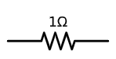

> 也可以使用`d.add(elm.Resistor())`

### 3. 绘制一个简单的电路：

```python
with schemdraw.Drawing() as d:
    d += elm.Resistor().right().label('1Ω')
    d += elm.Capacitor().down().label('10μF')
    d += elm.Line().left()
    d += elm.SourceSin().up().label('10V')
```

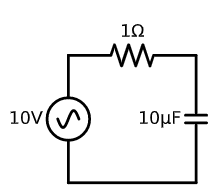

### 4. 保存图片

使用:

```python
with schemdraw.Drawing(file='my_circuit.svg') as d:
    ...
```

> 也可以保存为jpg， png， pdf， 等

还可以使用`schemdraw.Drawing.save()`

例：

```python
with schemdraw.Drawing() as d:
    ...
    d.save('my_name.jpg', dpi=1000)
```

> 这个似乎要比上面那个好用一些， 可以比较方便地控制dpi

不过似乎复杂的电路图画起来很麻烦


## 异常处理

```python 
try:
    可能产生异常的代码块
    
except [(Error1, Error2, ...)] [as e]:
    代码块1
except [(Error3)] [as e]:
    代码块2
except [Exception]:
    处理其他异常
    
```

```python
try:
    a = int(input("输入被除数："))
    b = int(input("输入除数："))
    c = a / b
    print("您输入的两个数相除的结果是：", c )
except (ValueError, ArithmeticError):
    print("程序发生了数字格式异常、算术异常之一")
except Exception as e:
    print(e)
except :
    print("未知异常")
print("程序继续运行")
```

```pyt
try:
    1/0
except Exception as e:
    # 访问异常的错误编号和详细信息
    print(e.args)
    print(str(e))
    print(repr(e))
    print(e)
```


## 其他问题

### 异或==^==: 

将两个数编程二进制，然后每一位相同就变成0不同就变成1如

例如：9 = 1001    7 = 0111    9 ^ 7 = 1110 = 14

任意两个相同的数异或结果为0

### 特殊方法

又叫双下划线方法(dunder method)

由解释器调用，自己不用调用

这些特殊方法名能让你自己的对象实现和支持以下的语言构架，并与之交互：

- 迭代 (`__iter__`, `__reversed__`...)
- 集合类 (`__getitem__`, `__len__` ...)
- 属性访问 (`__getattr__`, `__setattr__`...)
- 运算符重载 (`__lt__`, `__add__`...)
- 对象的创建和销毁 (`__new__`, `__del__`...)
- 字符串表示形式和格式 (`__repr__`, `__str__`...)
- 管理上下文（即with模块）(`__enter__`, `__exit__`)

### 字节串（bytes)

字节串（bytes）和字符串（string）的对比：

- 字符串由若干个字符组成，以字符为单位进行操作；字节串由若干个字节组成，以字节为单位进行操作。
- 字节串和字符串除了操作的数据单元不同之外，它们支持的所有方法都基本相同。
- 字节串和字符串都是不可变序列，不能随意增加和删除数据。

> 一般网络上发送和传输的字符串都是bytes类型的

```python
In [14]: b
Out[14]: b'https:www.baidu.com'

In [15]: b1 = bytes()
In [16]: #通过空字符串创建空 bytes
In [17]: b2 = b''
In [18]: #通过b前缀将字符串转换成 bytes
In [19]: b3 = b'http://c.biancheng.net/python/'
In [20]: print("b3: ", b3)
b3:  b'http://c.biancheng.net/python/'

In [21]: print(b3[3])
112

In [22]: print(b3[7:22])
b'c.biancheng.net'

In [23]: b2
Out[23]: b''

In [24]: b3
Out[24]: b'http://c.biancheng.net/python/'

In [25]: b3.decode()
Out[25]: 'http://c.biancheng.net/python/'

In [26]: print(b3)
b'http://c.biancheng.net/python/'

In [31]: type(b3.decode())
Out[31]: str

In [32]: type(b3)
Out[32]: bytes
```


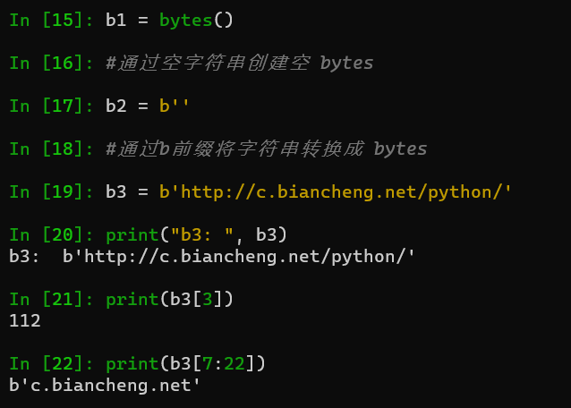

bytes解码之后就是str

```python
In [31]: type(b3.decode())
Out[31]: str
```

str 和bytes的相互转换

```python
In [35]: b3s = b3.decode()

In [36]: b3s
Out[36]: 'http://c.biancheng.net/python/'

In [37]: b3s.encode()
Out[37]: b'http://c.biancheng.net/python/'

In [38]: type(b3s)
Out[38]: str

In [40]: type(b3s.encode())
Out[40]: bytes

In [41]:
```

