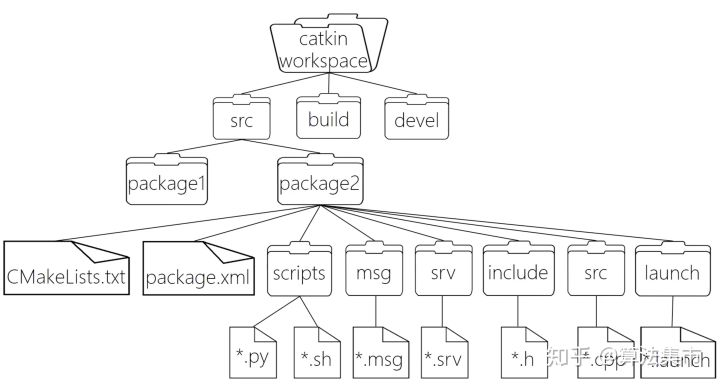

# ROS

## ROS目录结构


如上图所示，首先是最顶层的catkin工作空间，它是整个ROS工程中层次最高的概念。

工作空间也就是管理和组织ROS工程项目文件的地方。其下主要的一级目录有四个：

- src：源空间：ROS的catkin软件包（源代码包）
- build：编译空间：catkin（CMake）的缓存信息和中间文件
- devel：开发空间：生成目标文件（包括头文件，动态链接库，静态链接库，可执行文件等）、环境变量
- install：安装空间

其中，

- 最顶层的工作空间（可以任意命名）和 src （必须为src）文件夹是需要自己创建；
- build 和 devel 文件夹由 catkin_make 命令自动创建；
- install 文件夹由 catkin_make install 命令自动创建。

> catkin 是 ROS 定制的编译构建系统，是对CMake的扩展，对ROS这样大体量的工程有更好的支持，同时也简化了操作。

**注意：使用 catkin_make 编译之前一定要回到最顶层的工作空间。**


### 1、src：源空间

存放功能包（package）。

功能包是ROS文件系统中组织程序文件的基本单元，也就是catkin编译的基本单元。一个 package 下必须包含 CMakeLists.txt 和 package.xml 两个文件：

- CMakeLists.txt 文件中规定了功能包的编译规则，包括指定功能包名称，指定编译依赖项，指定要编译的源文件，指定要添加的消息格式文件/服务格式文件/动作格式文件，指定生成的消息/服务/动作，指定头文件搜索目录，指定链接库搜索目录，指定生成的静态链接库文件，指定需要链接的库文件，指定编译生成的可执行文件以及路径等等。
- package.xml 文件定义了功能包的属性信息，包括包名，版本号，作者，编译依赖和运行依赖等。

另外，

- include 和 src 分别存放头文件（*.h）和源程序文件（*.c/*.cpp等）；
- scripts 存放脚本文件（比如Python文件 *.py，shell文件 *.sh）；
- launch 存放 launch文件（*.launch），用于批量运行多个可执行文件；
- config 存放配置文件（*.yaml等）；

此外，还有自定义的通信格式文件，包括消息（*.msg）、服务（*.srv）以及动作（*.action）。



### 2、build：编译空间

存放CMake和catkin的缓存信息、配置信息和其他中间文件。

### 3、devel：开发空间

存放编译后生成的目标文件，包括头文件、动态&静态链接库、可执行文件等。

### 4、install：安装空间

即开发完成后的安装包。

## catkin编译系统

使用catkin_make进行编译一般流程：

```bash
$ cd ~/catkin_ws #回到工作空间,catkin_make必须在工作空间下执行
$ catkin_make    #开始编译
$ source ~/catkin_ws/devel/setup.bash #刷新坏境
```

**注意:** catkin编译之前需要回到工作空间目录，`catkin_make`在其他路径下编译不会成功。编译完成后，如果有新的目标文件产生（原来没有），那么一般紧跟着要source刷新环境，使得系统能够找到刚才编译生成的ROS可执行文件。这个细节比较容易遗漏，致使后面出现可执行文件无法打开等错误。

`catkin_make`命令也有一些可选参数，例如：

```xml
catkin_make [args]
   -h, --help            帮助信息
   -C DIRECTORY, --directory DIRECTORY
                         工作空间的路径 (默认为 '.')
   --source SOURCE       src的路径 (默认为'workspace_base/src')
   --build BUILD         build的路径 (默认为'workspace_base/build')
   --use-ninja           用ninja取代make
   --use-nmake           用nmake取'make
   --force-cmake         强制cmake，即使已经cmake过
   --no-color            禁止彩色输出(只对catkin_make和CMake生效)
   --pkg PKG [PKG ...]   只对某个PKG进行make
   --only-pkg-with-deps  ONLY_PKG_WITH_DEPS [ONLY_PKG_WITH_DEPS ...]
                         将指定的package列入白名单CATKIN_WHITELIST_PACKAGES，
                         之编译白名单里的package。该环境变量存在于CMakeCache.txt。
   --cmake-args [CMAKE_ARGS [CMAKE_ARGS ...]]
                         传给CMake的参数
   --make-args [MAKE_ARGS [MAKE_ARGS ...]]
                         传给Make的参数
   --override-build-tool-check
                         用来覆盖由于不同编译工具产生的错误
```


## Catkin工作空间

创建catkin工作空间

```bash
$ mkdir -p ~/catkin_ws/src  # 创建了第二层级的文件夹src，这是放ROS软件包的地方
$ cd ~/catkin_ws/src        # 进入工作空间，catkin_make必须在工作空间这个路径上执行
$ catkin_init_workspace     # 初始化src目录，生成的CMakeLists.txt为功能包编译配置
```

然后编译见上面内容

检查环境变量

要想保证工作空间已配置正确，需确保`ROS_PACKAGE_PATH`环境变量包含你的工作空间目录，采用以下命令查看：

```bash
$ echo $ROS_PACKAGE_PATH
 #  出现 /home/<youruser>/catkin_ws/src:/opt/ros/kinetic/share
```

到此你的工作环境已经搭建完成。

##  **Package软件包**

- ROS程序只有组成package才能编译；
- package是ROS源代码存放的地方；
- ROS的代码无论是C++还是Python都要放到package中，这样才能正常的编译和运行；
- 一个package可以编译出来多个目标文件（ROS可执行程序、动态静态库、头文件等等）。

## **2 ROS卸载步骤**

第一步，卸载功能包

```bash
sudo apt-get purge ros-*           # *功能包的名字
```

第二步，卸载包的依赖包

```bash
sudo apt-get autoremove
```
