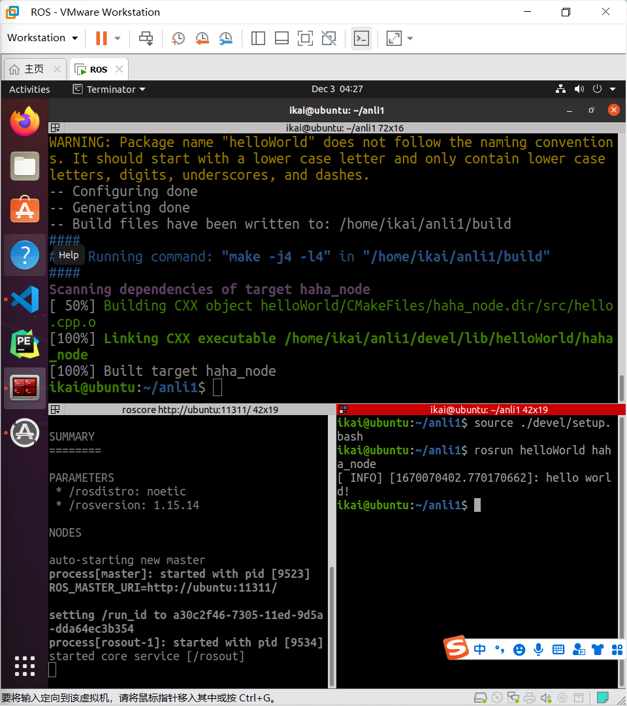
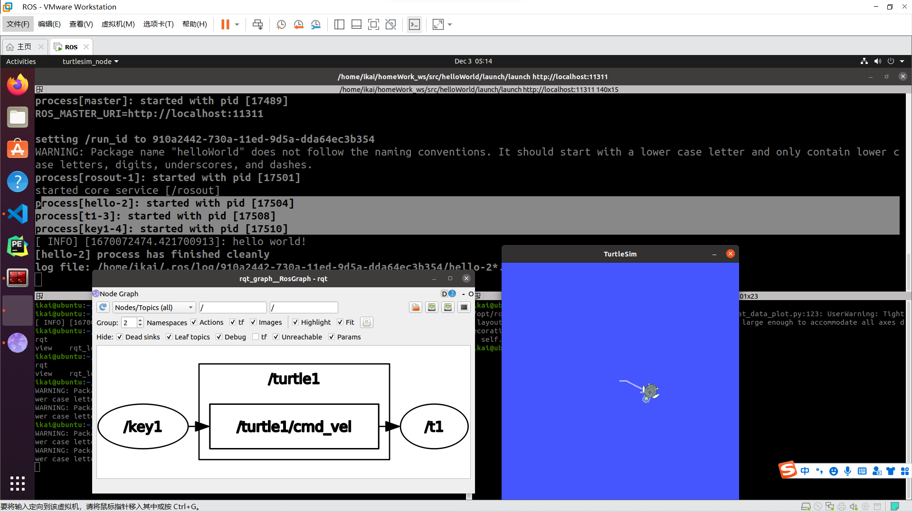

# ROS课程

## 安装ROS

> Ubuntu20.04， ROS1

使用鱼香：`wget http://fishros.com/install -O fishros && . fishros`

然后按照提示接着输入就行了。

## 测试ROS（小乌龟）

打开一个终端输入`roscore`

打开第二个终端输入`rosrun turtlesim turtlesim_node`

> 启动节点方法`rosrun pkg_name node-name`

打开第三个终端输入`rosrun turtlesim turtle_teleop_key`

然后可以键盘操作小乌龟，就说明没问题了。

可以在打开一个终端输入`rqt_graph`查看节点关系和话题列表。

## 新建工作空间目录

```bash
mkdir -p catkin_ws/src
cd catkin_ws/src
catkin_init_worksapce  # 初始化工作空间

cd ..
catkin_make  # 编译工作空间


source devel/setup.bash  # 工作空间环境变量生效

echo $ROS_PACKAGE_PATH  # 检测
```

## 创建功能包

命令

```bash
catkin_creat_pkg <package_name> [depend1] [depend2] [depend3]
```

例如：

```bash
cd catkin_ws/src
catkin_create_pkg learning_communication std_msgs rospy roscpp
# 在src中生成一个learning_communication功能包，其中包括package.xml 和CMakeLists.txt
```

回到工作空间根目录下进行编译和设置环境变量

```bash
cd catkin_ws
catkin_make
source devel/setup.bash
```

## hello world尝试

```shell
mkdir -p demo/src
cd demo
catkin_make
# 创建工作空间并初始化

cd src
catkin_create_pkg hello_world roscpp rospy std_msgs
# 创建功能包并添加依赖那个hello_world就是一个功能包

# 编辑CMakeList.txt
add_executable(${PROJECT_NAME}_node src/hello.cpp)  # 136行

target_link_libraries(${PROJECT_NAME}_node
  ${catkin_LIBRARIES}
)  # 149行

# 进入工作空间并编译
cd demo
catkin_make

# 运行
roscore
cd demo
source  ./devel/setup.bash
rosrun hello_world hello_world_node

```


### 安装一个**Terminator**终端

```shell
sudo apt install terminator
```


## rosbag

可以录制操作或者回放操作

1. 准备

   创建目录保存录制的文件

   ```shell
   mkdir ./xxx
   cd xxx 
   ```

2. 开始录制

   ```shell
   rosbag record -a -O 目标文件
   ```

   > 操作小乌龟一段时间，结束录制使用 ctrl + c，在创建的目录中会生成bag文件。

3. 查看

   ```shell
   rosbag info 文件名
   ```

4. 回放文件

   ```shell
   rosbag play 文件名
   ```

   > 重启乌龟节点，会发现，乌龟按照录制时的轨迹运动。

   

## HelloWorld实现

### 1.C++实现

1. 创建工作空间

   ```shell
   mkdir -p anli1/src
   cd anli1
   catkin_make
   ```

   

2. 创建功能包

   ```shell
   cd src 
   catkin_create_pkg helloWorld roscpp rsopy std_msgs
   ```

   > 会在工作空间下生成一个功能包，该功能包依赖于 roscpp、rospy 与 std_msgs，其中roscpp是使用C++实现的库，而rospy则是使用python实现的库，std_msgs是标准消息库，创建ROS功能包时，一般都会依赖这三个库实现。

   

3. 编辑原文件

   ```shell
   cd helloWorld
   cd src
   vim hello.cpp
   ```

   ```c++
   #include "ros/ros.h"
   
   int main(int argc, char *argv[])
   {
       //执行 ros 节点初始化
       ros::init(argc,argv,"hello");
       //创建 ros 节点句柄(非必须)
       ros::NodeHandle n;
       //控制台输出 hello world
       ROS_INFO("hello world!");
   
       return 0;
   }
   ```

4. 编辑配置文件

   编辑ros包下的Cmakelist.txt文件添加：

   ```cmake
   add_executable(haha
     src/步骤3的源文件名.cpp  # 这个必须是源文件名称，但是其他两个似乎可以用其他的
   )
   target_link_libraries(haha
     ${catkin_LIBRARIES}
   )
   ```

   

5. 编译并执行

   ```shell
   cd ~/anli1
   catkin_make
   ```

   启动命令行1：`roscore`

   启动命令行2：

   ```sehll
   cd anli1
   source ./devel/setup.bash
   rosrun helloWorld haha
   ```

   > 命令行输出HelloWorld！

   

### 2.Python实现

   前面的部分和C++一样不同的部分：

   1. 进入ros包添加scripts目录并编辑Python文件
   
      ```shell
      cd helloWorld
      mkdir scripts
      cd scripts
      vim hello.py
      ```
   
      ```python
      #! /usr/bin/env python
      
      """
          Python 版 HelloWorld
      
      """
      import rospy
      
      if __name__ == "__main__":
          rospy.init_node("Hello")
          rospy.loginfo("Hello World!!!!")
      ```
   
   2. 为Python文件添加可执行权限
   
      `chmod +x hello.py`  # 其实这一步可以不用的
   
   3. 编辑ros包下的CmakeList.txt文件
   
      ```cmake
      catkin_install_python(PROGRAMS scripts/自定义文件名.py
        DESTINATION ${CATKIN_PACKAGE_BIN_DESTINATION}
      )
      ```
   
   4. 进入工作空间并编译
   
      ```shell
      cd anli1
      catkin_make
      ```
   
   5. 进入工作空间目录并执行
   
      先启动命令行1：
   
      `roscore`
   
      在启动命令行2：
   
      ```shell
      cd anli1
      source ./devel/setup.bash
      rosrun helloWorld hello.py
      ```
   
      > 输出Hello World！！！
      
      也没有任何问题了

## 作业



如图所示通过launch运行了小乌龟的两个节点：t1 和key1还有一个自己写的helloworld节点