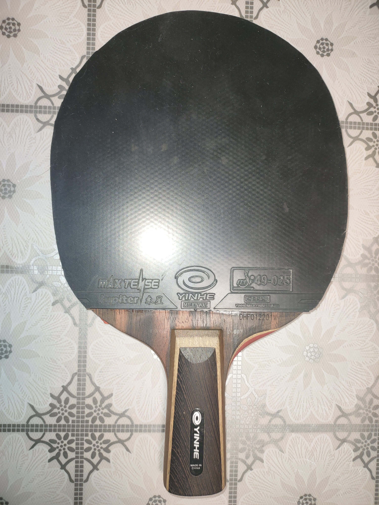
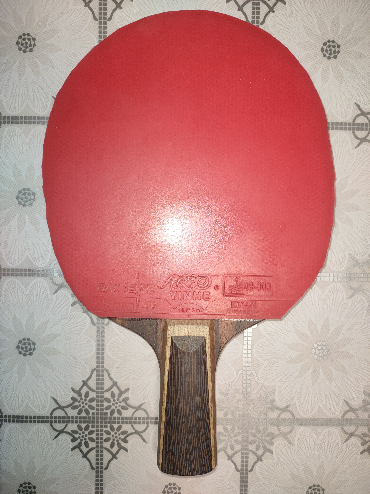
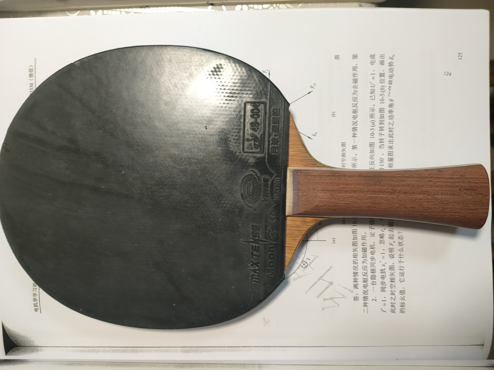
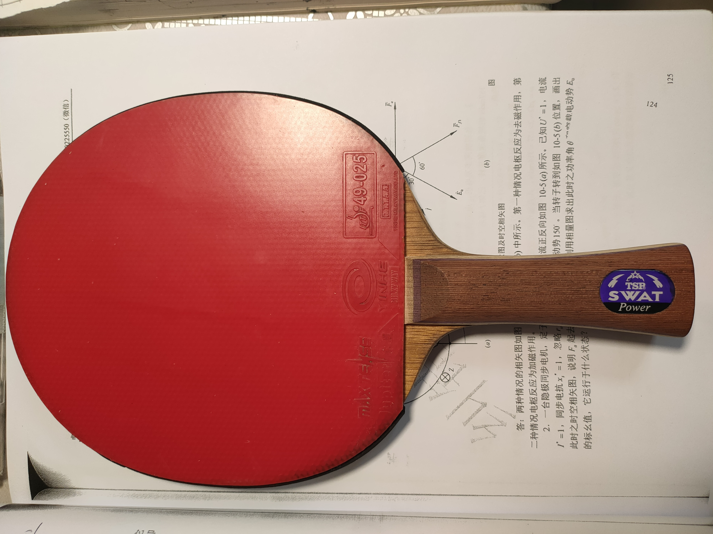
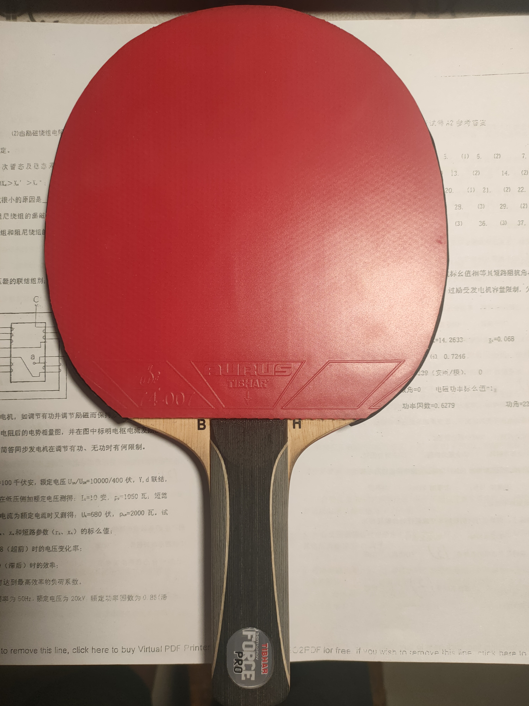
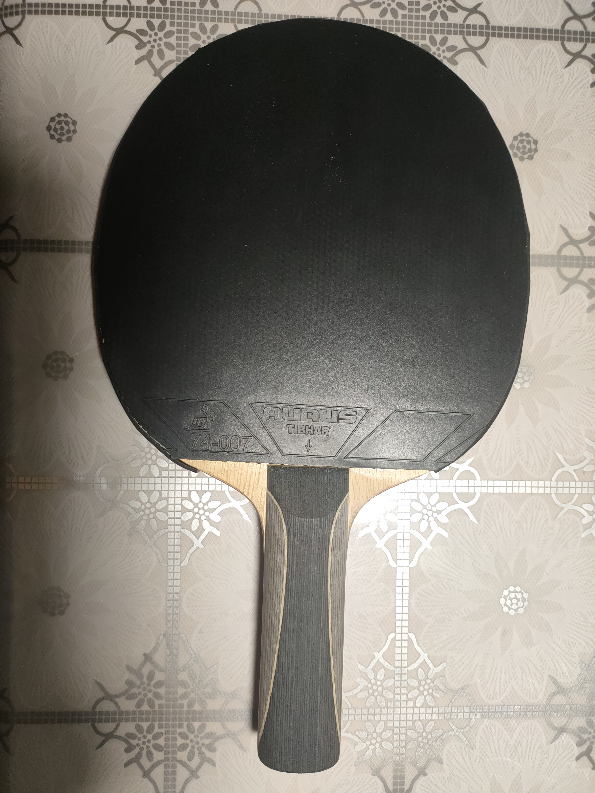
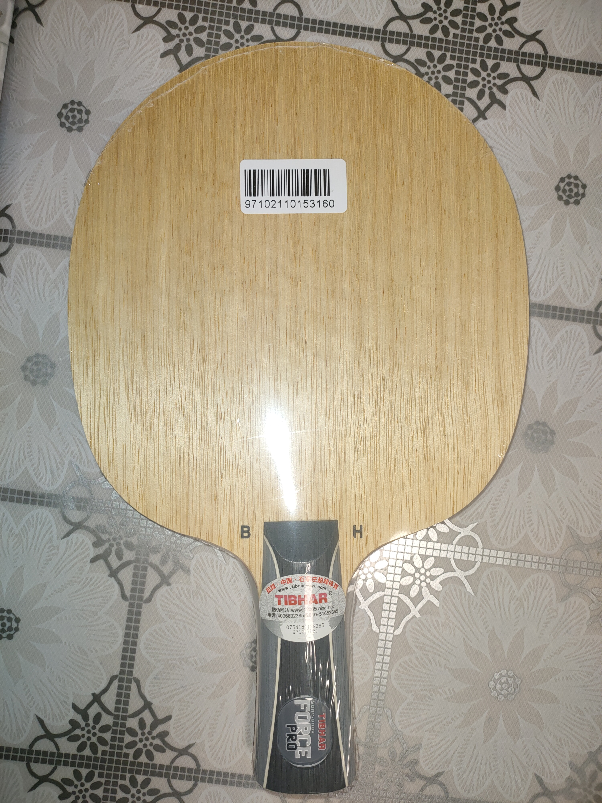
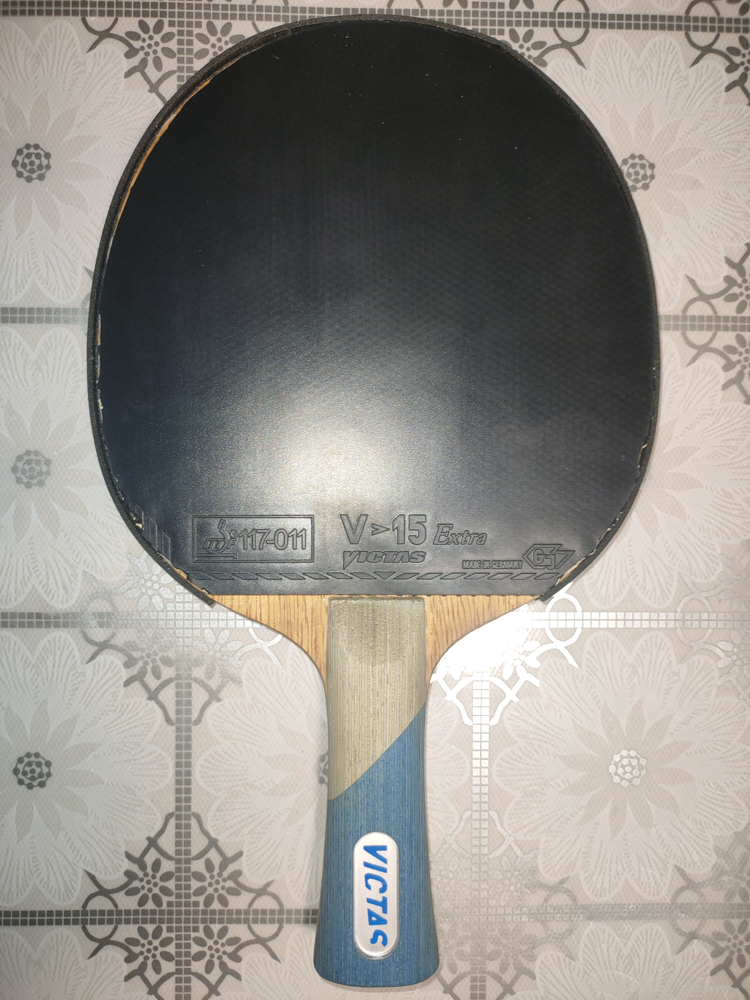
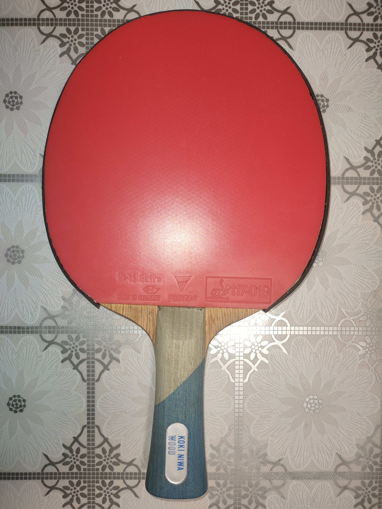

# 打过的乒乓球拍总结

## 银河D-607（CS）：

七层纯木，CL结构，黑檀面材，

配胶：木星3+月球

## 红双喜H301T（CS）：

## TSP SWAT Power（FL）：

7层纯木

15 * 16.2cm

## 无字黑萨（ST）：

15.8 * 15.2cm

## 无字黑萨（CS）:

16 * 15.2cm

## niwa木（FL）：

